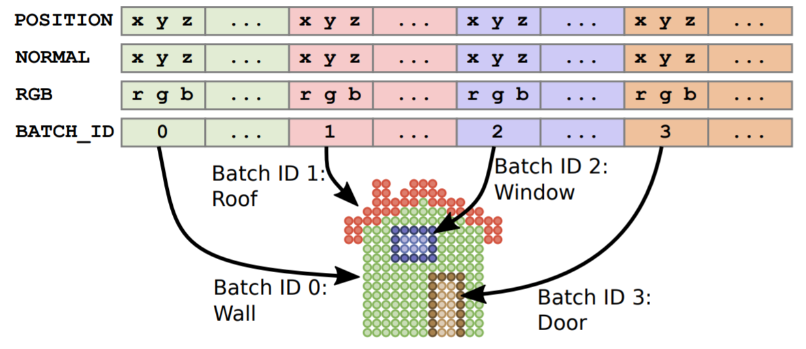

# CESIUM\_3dtiles\_feature\_metadata

## Contributors

TODO

## Status

TODO

* Update diagrams
* `values` and `accessor` are mutually exclusive
* Fill in other TODO's

## Dependencies

Written against the glTF 2.0 spec. Depends on KHR_mesh_instancing for instanced features.

## Overview

TODO

## Summary

This extension allows offline batching of heterogeneous 3D models, such as different buildings in a city, for efficient streaming to a client for rendering and interaction. Efficiency comes from transferring multiple models in a single request and rendering them in the least number of draw calls necessary. Using the core 3D Tiles spec language, each model is a feature.

Per-feature IDs enable individual features to be identified and updated at runtime, e.g., show/hide, highlight color, etc. IDs may be used to query application-specific properties for styling and any application-specific use cases such as populating a UI or issuing a REST API request.

A _Feature Table_ contains per-feature application-specific properties. Some example feature table properties are building heights, geographic coordinates, and database primary keys. A _feature id_ vertex attribute is used to identify the vertices belonging to a feature, and that feature's properties may be retrieved from the feature table.


Multiple feature ids and feature tables are allowed to support feature layers. For example, in point cloud models it may be useful to store both per-point properties and per-group properties - in the first layer each point is considered a feature; in the second layer each group of points is considered a feature.



### Feature Id

This extension adds a new indexed attribute semantic `_FEATURE_ID_0`. All indices must start with 0 and be continuous positive integers: `_FEATURE_ID_0`, `_FEATURE_ID_1`, `_FEATURE_ID_2`, etc. Each attribute represents a different feature layer and its corresponding feature table.

The mapping between feature id attributes and their feature tables is defined in the primitive's `CESIUM_3dtiles_feature_metadata` extension object where the key is the attribute name and the value is the index into the `featureTables` array in the top-level `CESIUM_3dtiles_feature_metadata` extension. In the example below `_FEATURE_ID_0` corresponds to the first feature table and `_FEATURE_ID_1` corresponds the third feature table.

```json
"primitives": [
  {
    "attributes": {
      "POSITION": 0,
      "_FEATURE_ID_0": 1,
      "_FEATURE_ID_1": 2
    },
    "indices": 3,
    "material": 0,
    "mode": 4,
    "extensions": {
      "CESIUM_3dtiles_feature_metadata": {
        "attributes": {
          "_FEATURE_ID_0": 0,
          "_FEATURE_ID_1": 2
        }
      }
    }
  }
]
```

`_FEATURE_ID_0` is a required attribute for all primitives in the glTF; additional feature id attributes are optional. Clients are required to support at least `_FEATURE_ID_0`.

Valid accessor type and component type for the `_FEATURE_ID_0` attribute semantic property are defined below.

|Name|Accessor Type(s)|Component Type(s)|Description|
|----|----------------|-----------------|-----------|
|`_FEATURE_ID_0`|`"SCALAR"`|`5121`&nbsp;(UNSIGNED_BYTE)<br>`5123`&nbsp;(UNSIGNED_SHORT)<br>`5125`&nbsp;(UNSIGNED_INT)|Feature id within a feature layer |

Note that to comply with alignment rules for accessors, accessors need to be aligned to 4-byte boundaries; for example, an `UNSIGNED_BYTE` feature id is expected to have a stride of 4, not 1.

#### Feature Id Accessor Requirements

Each component in the feature id accessor must be in the range `[0, featureCount - 1]` inclusive, where `featureCount` is the number of features in the feature layer.

In certain cases, feature id components can be implicity defined. When `bufferView` is not defined:

* If `accessor.count` equals `featureCount`, the accessor must be initialized with consecutive integers starting at 0 and ending at `featureCount - 1`, e.g. `[0, 1, 2, 3, ..., featureCount - 1]`. This can provide memory savings when each point in a point cloud is its own feature and feature ids do not need to be explicity defined.
* Otherwise if `accessor.count` does not equal `featureCount` the accessor must be initialized with zeros, in accordance with the glTF accessor schema. This can provide memory savings if the model consists of single feature.

### Feature Table

A feature table contains per-feature application-specific properties. A feature table may contain any number of properties, or no properties at all. The number of features is specified in the `featureCount` property. `featureCount` must be greater than or equal to 1.

Feature Table properties can be represented in two different ways:

1. An array of values
    * Array elements can be any valid JSON data type, including objects and arrays.  Elements may be `null`.
    * The length of each array must be equal to `featureCount`.
2. A reference to binary data via an accessor.
    * The accessor's count must be equal to `featureCount`.
    
It is more efficient to store long numeric arrays in accessors.

#### Example

Feature table containing a mix of JSON and binary properties for two buildings (features)

```json
{
  "featureCount": 2,
  "properties": {
    "name": {
      "values": [
        "Building name",
        "Another building name"
      ]
    },
    "yearBuilt": {
      "values": [
        1999,
        2015
      ]
    },
    "address": {
      "values": [
        {
          "street": "Main Street",
          "houseNumber": "1"
        },
        {
          "street": "Main Street",
          "houseNumber": "2"
        }
      ]
    },
    "geographicCoordinates": {
      "accessor": 0
    },
    "zone": {
      "accessor": 1
    }
  }
}
```

#### Feature Table Accessors Requirements

For each feature table property's accessor, `accessor.count` must equal `featureCount`.

## Optional vs. Required

This extension is optional, meaning it should be placed in the glTF root's `extensionsUsed` list, but not in the `extensionsRequired` list.

## See Also

TODO

## glTF Schema Updates

TODO

## Known Implementations

TODO

## Examples

### Batched models with JSON properties

```json
{
  "accessors": [
    {
      "name": "positions (float)",
      "bufferView": 0,
      "byteOffset": 0,
      "componentType": 5126,
      "count": 8,
      "type": "VEC3"
    },
    {
      "name": "feature ids (unsigned byte)",
      "bufferView": 1,
      "byteOffset": 0,
      "componentType": 5121,
      "count": 8,
      "type": "SCALAR"
    },
    {
      "name": "indices (unsigned short)",
      "bufferView": 2,
      "byteOffset": 0,
      "componentType": 5123,
      "count": 12,
      "type": "SCALAR"
    }
  ],
  "meshes": [
    {
      "primitives": [
        {
          "name": "two buildings composed of two triangles each",
          "attributes": {
            "POSITION": 0,
            "_FEATURE_ID_0": 1
          },
          "indices": 2,
          "material": 0,
          "mode": 4,
          "extensions": {
            "CESIUM_3dtiles_feature_metadata": {
              "attributes": {
                "_FEATURE_ID_0": 0
              }
            }
          }
        }
      ]
    }
  ],
  "extensionsUsed": [
    "CESIUM_3dtiles_feature_metadata"
  ],
  "extensions": {
    "CESIUM_3dtiles_feature_metadata": {
      "featureTables": [
        {
          "featureCount": 2,
          "properties": {
            "name": {
              "values": [
                "Building name",
                "Another building name"
              ]
            },
            "yearBuilt": {
              "values": [
                1999,
                2015
              ]
            },
            "address": {
              "values": [
                {
                  "street": "Main Street",
                  "houseNumber": "1"
                },
                {
                  "street": "Main Street",
                  "houseNumber": "2"
                }
              ]
            }
          }
        }
      ]
    }
  }
}
```

### Batched models with binary properties

```json
{
  "accessors": [
    {
      "name": "positions (float)",
      "bufferView": 0,
      "byteOffset": 0,
      "componentType": 5126,
      "count": 8,
      "type": "VEC3"
    },
    {
      "name": "feature ids (unsigned byte)",
      "bufferView": 1,
      "byteOffset": 0,
      "componentType": 5121,
      "count": 8,
      "type": "SCALAR"
    },
    {
      "name": "indices (unsigned short)",
      "bufferView": 2,
      "byteOffset": 0,
      "componentType": 5123,
      "count": 12,
      "type": "SCALAR"
    },
    {
      "name": "id property (unsigned int)",
      "bufferView": 3,
      "byteOffset": 0,
      "componentType": 5125,
      "count": 2,
      "type": "SCALAR"
    },
    {
      "name": "cartographic property (vec3 float)",
      "bufferView": 4,
      "byteOffset": 0,
      "componentType": 5126,
      "count": 2,
      "type": "VEC3"
    }
  ],
  "meshes": [
    {
      "primitives": [
        {
          "name": "two buildings composed of two triangles each",
          "attributes": {
            "POSITION": 0,
            "_FEATURE_ID_0": 1
          },
          "indices": 2,
          "material": 0,
          "mode": 4,
          "extensions": {
            "CESIUM_3dtiles_feature_metadata": {
              "attributes": {
                "_FEATURE_ID_0": 0
              }
            }
          }
        }
      ]
    }
  ],
  "extensionsUsed": [
    "CESIUM_3dtiles_feature_metadata"
  ],
  "extensions": {
    "CESIUM_3dtiles_feature_metadata": {
      "featureTables": [
        {
          "featureCount": 2,
          "properties": {
            "id": {
              "accessor": 3
            },
            "cartographic": {
              "accessor": 4
            }
          }
        }
      ]
    }
  }
}
```

### Point cloud with per-point properties and per-group properties;

```json
{
  "accessors": [
    {
      "name": "positions (float)",
      "bufferView": 0,
      "byteOffset": 0,
      "componentType": 5126,
      "count": 8,
      "type": "VEC3"
    },
    {
      "name": "colors (unsigned byte)",
      "bufferView": 1,
      "byteOffset": 0,
      "componentType": 5121,
      "count": 8,
      "type": "VEC3"
    },
    {
      "name": "per-point feature ids (implicitly 0 to featureCount-1) (feature table 0) (unsigned byte)",
      "componentType": 5121,
      "count": 8,
      "type": "SCALAR"
    },
    {
      "name": "per-feature feature ids (feature table 1) (unsigned byte)",
      "bufferView": 2,
      "byteOffset": 0,
      "componentType": 5121,
      "count": 8,
      "type": "SCALAR"
    },
    {
      "name": "intensity property (unsigned short)",
      "bufferView": 3,
      "byteOffset": 0,
      "componentType": 5123,
      "count": 8,
      "type": "SCALAR"
    },
    {
      "name": "classification property (unsigned byte)",
      "bufferView": 4,
      "byteOffset": 0,
      "componentType": 5121,
      "count": 8,
      "type": "SCALAR"
    },
    {
      "name": "id property (unsigned int)",
      "bufferView": 5,
      "byteOffset": 0,
      "componentType": 5125,
      "count": 2,
      "type": "SCALAR"
    },
    {
      "name": "cartographic property (vec3 float)",
      "bufferView": 6,
      "byteOffset": 0,
      "componentType": 5126,
      "count": 2,
      "type": "VEC3"
    }
  ],
  "meshes": [
    {
      "primitives": [
        {
          "name": "two buildings composed of four points each",
          "attributes": {
            "POSITION": 0,
            "COLOR_0": 1,
            "_FEATURE_ID_0": 2,
            "_FEATURE_ID_1": 3
          },
          "mode": 0,
          "extensions": {
            "CESIUM_3dtiles_feature_metadata": {
              "attributes": {
                "_FEATURE_ID_0": 0,
                "_FEATURE_ID_1": 1
              }
            }
          }
        }
      ]
    }
  ],
  "extensionsUsed": [
    "CESIUM_3dtiles_feature_metadata"
  ],
  "extensions": {
    "CESIUM_3dtiles_feature_metadata": {
      "featureTables": [
        {
          "featureCount": 8,
          "properties": {
            "intensity": {
              "accessor": 4
            },
            "classification": {
              "accessor": 5
            }
          }
        },
        {
          "featureCount": 2,
          "properties": {
            "id": {
              "accessor": 6
            },
            "cartographic": {
              "accessor": 7
            }
          }
        }
      ]
    }
  }
}
```

### Single feature example

```json
{
  "accessors": [
    {
      "name": "positions (float)",
      "bufferView": 0,
      "byteOffset": 0,
      "componentType": 5126,
      "count": 4,
      "type": "VEC3"
    },
    {
      "name": "feature ids (implicitly zeros) (unsigned byte)",
      "componentType": 5121,
      "count": 4,
      "type": "SCALAR"
    },
    {
      "name": "indices (unsigned short)",
      "bufferView": 1,
      "byteOffset": 0,
      "componentType": 5123,
      "count": 6,
      "type": "SCALAR"
    }
  ],
  "meshes": [
    {
      "primitives": [
        {
          "name": "one building composed of two triangles",
          "attributes": {
            "POSITION": 0,
            "_FEATURE_ID_0": 1
          },
          "indices": 2,
          "material": 0,
          "mode": 4,
          "extensions": {
            "CESIUM_3dtiles_feature_metadata": {
              "attributes": {
                "_FEATURE_ID_0": 0
              }
            }
          }
        }
      ]
    }
  ],
  "extensionsUsed": [
    "CESIUM_3dtiles_feature_metadata"
  ],
  "extensions": {
    "CESIUM_3dtiles_feature_metadata": {
      "featureTables": [
        {
          "featureCount": 1,
          "properties": {
            "name": {
              "values": [
                "Building name"
              ]
            }
          }
        }
      ]
    }
  }
}
```

### Composite example

```json
{
  "accessors": [
    {
      "name": "point positions (float)",
      "bufferView": 0,
      "byteOffset": 0,
      "componentType": 5126,
      "count": 8,
      "type": "VEC3"
    },
    {
      "name": "point colors (unsigned byte)",
      "bufferView": 1,
      "byteOffset": 0,
      "componentType": 5121,
      "count": 8,
      "type": "VEC3"
    },
    {
      "name": "per-point feature ids (implicitly 0 to featureCount-1) (feature table 0) (unsigned byte)",
      "componentType": 5121,
      "count": 8,
      "type": "SCALAR"
    },
    {
      "name": "per-group feature ids (feature table 1) (unsigned byte)",
      "bufferView": 2,
      "byteOffset": 0,
      "componentType": 5121,
      "count": 8,
      "type": "SCALAR"
    },
    {
      "name": "intensity property (unsigned short)",
      "bufferView": 3,
      "byteOffset": 0,
      "componentType": 5123,
      "count": 8,
      "type": "SCALAR"
    },
    {
      "name": "classification property (unsigned byte)",
      "bufferView": 4,
      "byteOffset": 0,
      "componentType": 5121,
      "count": 8,
      "type": "SCALAR"
    },
    {
      "name": "id property (unsigned int)",
      "bufferView": 5,
      "byteOffset": 0,
      "componentType": 5125,
      "count": 2,
      "type": "SCALAR"
    },
    {
      "name": "cartographic property (vec3 float)",
      "bufferView": 6,
      "byteOffset": 0,
      "componentType": 5126,
      "count": 2,
      "type": "VEC3"
    },
    {
      "name": "positions (float)",
      "bufferView": 7,
      "byteOffset": 0,
      "componentType": 5126,
      "count": 8,
      "type": "VEC3"
    },
    {
      "name": "feature ids (unsigned byte)",
      "bufferView": 8,
      "byteOffset": 0,
      "componentType": 5121,
      "count": 8,
      "type": "SCALAR"
    },
    {
      "name": "indices (unsigned short)",
      "bufferView": 9,
      "byteOffset": 0,
      "componentType": 5123,
      "count": 12,
      "type": "SCALAR"
    }
  ],
  "meshes": [
    {
      "primitives": [
        {
          "name": "two buildings composed of four points each",
          "attributes": {
            "POSITION": 0,
            "COLOR_0": 1,
            "_FEATURE_ID_0": 2,
            "_FEATURE_ID_1": 3
          },
          "mode": 0,
          "extensions": {
            "CESIUM_3dtiles_feature_metadata": {
              "attributes": {
                "_FEATURE_ID_0": 0,
                "_FEATURE_ID_1": 1
              }
            }
          }
        },
        {
          "name": "two buildings composed of two triangles each",
          "attributes": {
            "POSITION": 8,
            "_FEATURE_ID_0": 9
          },
          "indices": 10,
          "material": 0,
          "mode": 4,
          "extensions": {
            "CESIUM_3dtiles_feature_metadata": {
              "attributes": {
                "_FEATURE_ID_0": 2
              }
            }
          }
        }
      ]
    }
  ],
  "extensionsUsed": [
    "CESIUM_3dtiles_feature_metadata"
  ],
  "extensions": {
    "CESIUM_3dtiles_feature_metadata": {
      "featureTables": [
        {
          "featureCount": 8,
          "properties": {
            "intensity": {
              "accessor": 4
            },
            "classification": {
              "accessor": 5
            }
          }
        },
        {
          "featureCount": 2,
          "properties": {
            "id": {
              "accessor": 6
            },
            "cartographic": {
              "accessor": 7
            }
          }
        },
        {
          "featureCount": 2,
          "properties": {
            "name": {
              "values": [
                "Building name",
                "Another building name"
              ]
            }
          }
        }
      ]
    }
  }
}
```