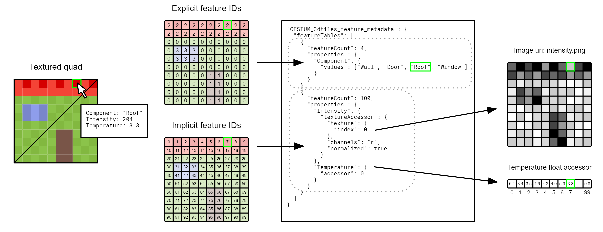

# CESIUM\_3dtiles\_feature\_metadata

## Contributors

TODO

## Status

TODO

## Dependencies

Written against the glTF 2.0 spec. Depends on `KHR_mesh_instancing` for instanced features.

## Overview

In Geographic Information Systems (GIS) a feature is an entity that has both geometry and application-specific properties. This extension adds a mechanism for identifying features within the glTF's vertex and texture data, as well as a database for storing per-feature properties.

A feature may be a building in a city, a pipe in a BIM/CAD model, a point in a point cloud, and an instanced tree in a forest. A glTF may contain any number of features and any number of per-feature properties.

<p align="center">

</p>

Geometry from different features may be batched into as few glTF primitives as possible to enable efficient rendering and interaction. Feature IDs, stored per-vertex or per-texel, enable individual features to be identified and updated at runtime, e.g., show/hide, highlight color, etc. Feature IDs may also be used to query properties from a feature table for styling and application-specific use cases such as populating a UI or issuing a REST API request. Some example feature table properties are building heights, geographic coordinates, and database primary keys.

A glTF primitive may contain one or more feature layers where each feature layer points to a feature table. Multiple feature layers enable different levels of feature granularity within a single dataset. For example, a point cloud may contain groups of points that represent different architectural components of a building while retaining per-point properties like intensity - in the first layer each group is considered a feature; in the second layer each point is considered a feature. Multiple feature layers also enable heterogeonous datasets to be combined into a single glTF payload.

<table style="table-layout: fixed">
  <tr>
    <td style="width: 50%;"></td>
    <td></td>
  </tr>
  <tr>
    <td>Left: A point cloud with two feature tables, one storing per-group properties and the other storing per-point properties.</td>
    <td>Right: A glTF containing a 3D mesh (house), a point cloud (tree), and instanced models (fencing) with three feature tables.</td>
  </tr>
</table>

A feature table may be extended to include feature classes and hierarchies. See the `CESIUM_3dtiles_feature_hierarchy` extension.

## Basic Example

The following example contains two features and a feature table with a mix of JSON and binary properties.

```json
{
  "meshes": [
    {
      "primitives": [
        {
          "attributes": {
            "POSITION": 0,
            "_FEATURE_ID_0": 1
          },
          "indices": 2,
          "extensions": {
            "CESIUM_3dtiles_feature_metadata": {
              "featureLayers": [
                {
                  "featureTable": 0,
                  "vertexAttribute": {
                    "attributeIndex": 0
                  }
                }
              ]
            }
          }
        }
      ]
    }
  ],
  "extensions": {
    "CESIUM_3dtiles_feature_metadata": {
      "featureTables": [
        {
          "featureCount": 2,
          "properties": {
            "Name": {
              "values": ["Building A", "Building B"]
            },
            "Year": {
              "values": [1999, 2015]
            },
            "Coordinates": {
              "accessor": 3
            }
          }
        }
      ]
    }
  },
  "accessors": [
    {
      "name": "Positions",
      "bufferView": 0,
      "byteOffset": 0,
      "componentType": 5126,
      "count": 8,
      "type": "VEC3"
    },
    {
      "name": "Feature IDs",
      "bufferView": 1,
      "byteOffset": 0,
      "componentType": 5126,
      "count": 8,
      "type": "SCALAR"
    },
    {
      "name": "Indices",
      "bufferView": 2,
      "byteOffset": 0,
      "componentType": 5123,
      "count": 12,
      "type": "SCALAR"
    },
    {
      "name": "Coordinates (longitude, latitude)",
      "bufferView": 3,
      "byteOffset": 0,
      "componentType": 5126,
      "count": 2,
      "type": "VEC2"
    }
  ]
}
```
<p>

</p>

## Concepts

### Feature Table

A feature table contains per-feature application-specific properties, indexable by a feature ID. A feature table may contain any number of properties, or no properties at all. The number of features is specified in the `featureCount` property. `featureCount` must be greater than or equal to 1.

Feature Table properties can be represented in three different ways:

1. `values`: an array of values
    * Array elements can be any valid JSON data type, including objects and arrays.  Elements may be `null`.
    * The length of each array must be equal to `featureCount`
2. `accessor`: a reference to binary data via a glTF accessor
    * The accessor's count must be equal to `featureCount`
3. `textureAccessor`: a view of a glTF texture
    * The feature ID is converted to texture coordinates with the following formula: `(featureId % textureWidth, featureId / textureWidth)`

`values`, `accessor`, and `textureAccessor` are mutually exclusive

It is more efficient to store long numeric arrays in accessors.

#### Texture Accessor

A texture accessor contains a reference to a glTF texture and information for accessing its values:

* `texture` - a `textureInfo` object where `texCoord` is ignored.
* `channels` - a string that defines both the type (scalar, vec2, vec3, vec4) and the color channels to read from. Example: "rgb" means this property is a vec3 and its values are obtained from the red, green, and blue channels. This is useful when packing properties into the same texture: one texture accessor might be "r", another might be "gb" and a last might be "a". The string must match the pattern `/^[rgba]{1,4}$/`. If the texture does not contain a particular color channel then the maximum value must be returned (e.g. 255 for 8-bit color depth).
* `normalized` - whether the texture data should be normalized to the `[0.0, 1.0]` range or not. This property is ignored for KTX2 images since KTX2 has native normalized and unnormalized image formats. Defaults to `false`.

Example: read the first channel of the texture and normalize to the `[0.0, 1.0]` range.

```json
{
  "texture": {
    "index": 0
  },
  "channels": "r",
  "normalized": true
}
```

### Feature ID

Feature IDs are stored inside the glTF primitive as vertex attributes or textures and are used to identify the features in a primitives and index into a feature table. A primitive may have multiple sets of feature IDs, or feature layers, from any combination of per-vertex and per-texel sources.

An individual feature layer contains the follow properties:

* `featureTable`: the index of the feature table used by this layer
* `instanceStride`: an optional property that specifies the per-instance stride to apply to feature IDs when the mesh is instanced by the `KHR_mesh_instancing` extension.
* `vertexAttribute`: the source for per-vertex feature IDs
* `texture`: the source for per-texel feature IDs

`vertexAttribute` and `texture` are mutually exclusive. Per-vertex and per-texel feature IDs cannot be used in the same feature layer.

Feature IDs, whether sourced from a vertex attribute or texture, are integral values in the range `[0, featureCount - 1]`, where `featureCount` is the number of features contained in the layer's feature table.

#### Per-vertex feature IDs

Vertices with the same feature ID are part of the same feature. Feature IDs can be defined explicitly via a `_FEATURE_ID_0` vertex attribute semantic, or implicitly as a constant number or consecutive numbers.

##### Explicit feature IDs

This extension adds a new indexed attribute semantic `_FEATURE_ID_0`. All indices must start with 0 and be continuous positive integers: `_FEATURE_ID_0`, `_FEATURE_ID_1`, `_FEATURE_ID_2`, etc.

The attribute's accessor `type` must be `"SCALAR"` and `normalized` must be `false`. There is no restriction on `componentType`, however as described above, all feature IDs must be in the range `[0, featureCount - 1]`.

A feature layer references a feature id attribute by its set index. For example, `"attributeIndex": 0` corresponds to `_FEATURE_ID_0` and `"attributeIndex": 1` corresponds to `_FEATURE_ID_1`.

An example of two feature layers with explicit feature IDs:

```json
{
  "primitives": [
    {
      "attributes": {
        "POSITION": 0,
        "_FEATURE_ID_0": 1,
        "_FEATURE_ID_1": 0
      },
      "indices": 2,
      "extensions": {
        "CESIUM_3dtiles_feature_metadata": {
          "featureLayers": [
            {
              "featureTable": 0,
              "vertexAttribute": {
                "attributeIndex": 0
              }
            },
            {
              "featureTable": 1,
              "vertexAttribute": {
                "attributeIndex": 1
              }
            }
          ]
        }
      }
    }
  ]
}
```

##### Implicit feature IDs

In some cases it's not necessary to define explicit feature IDs, like when all feature IDs are the same number or are consecutive numbers.

Instead feature IDs can be defined implicitly with two properties:

* `start`: the value of the first vertex
* `increment`: the amount to increment per-vertex. This may be set to `0` to maintain a constant value for all vertices or `1` to produce consecutive values.

Example: instanced mesh where each instance is assigned consecutive feature IDs

```json
{
  "nodes": [
    {
      "mesh": 0,
      "extensions": {
        "KHR_mesh_instancing": {
          "attributes": {
            "TRANSLATION": 2
          }
        }
      }
    }
  ],
  "meshes": [
    {
      "primitives": [
        {
          "attributes": {
            "POSITION": 0
          },
          "indices": 1,
          "mode": 4,
          "extensions": {
            "CESIUM_3dtiles_feature_metadata": {
              "featureLayers": [
                {
                  "featureTable": 0,
                  "instanceStride": 1,
                  "vertexAttribute": {
                    "implicit": {
                      "start": 0,
                      "increment": 0
                    }
                  }
                }
              ]
            }
          }
        }
      ]
    }
  ]
}
```

Example: point cloud where each point is assigned consecutive feature IDs

```json
{
  "primitives": [
    {
      "attributes": {
        "POSITION": 0
      },
      "mode": 0,
      "extensions": {
        "CESIUM_3dtiles_feature_metadata": {
          "featureLayers": [
            {
              "featureTable": 0,
              "vertexAttribute": {
                "implicit": {
                  "start": 0,
                  "increment": 1
                }
              }
            }
          ]
        }
      }
    }
  ]
}
```

#### Per-texel feature IDs

Feature IDs can also be stored in textures. The feature ID is determined by sampling a texture using the interpolated texture coordinates of the given `TEXCOORD` set at a particular point on the surface, like traditional texture mapping for a color texture. Per-texel feature IDs may be set explicitly or implicitly.

The `texture` object contains the following properties:

* `texCoord`: the set index of primitives's `TEXCOORD` attribute used for texture coordinate mapping
* `textureAccessor`: a view into a glTF texture that contains explicit feature IDs
* `implicit`: an object defining how implicit feature IDs are generated

`textureAccessor` and `implicit` are mutually exclusive.

When using `textureAccessor` the `channels` string must be a length of one and `normalized` must be `false`. See [Texture Accessor](#texture-accessor) for more information.

The implicit object contains four properties:

* `width`: the width of the texture in pixels
* `height`: the height of the texture in pixels
* `start`: the value of the top-left texel
* `increment`: the amount to increment per-texel (row-major top-to-bottom). This may be set to `0` to maintain a constant value for all texels or `1` to produce consecutive values.

Example: explicit and implicit texture feature IDs
<p align="center">

</p>


```json
{
  "meshes": [
    {
      "primitives": [
        {
          "attributes": {
            "POSITION": 0,
            "TEXCOORD_0": 1,
          },
          "indices": 2,
          "mode": 4,
          "extensions": {
            "CESIUM_3dtiles_feature_metadata": {
              "featureLayers": [
                {
                  "featureTable": 0,
                  "texture": {
                    "texCoord": 0,
                    "textureAccessor": {
                      "texture": {
                        "index": 0
                      },
                      "channels": "r"
                    }
                  }
                },
                {
                  "featureTable": 1,
                  "texture": {
                    "texCoord": 0,
                    "implicit": {
                      "width": 10,
                      "height": 10,
                      "start": 0,
                      "increment": 1
                    }
                  }
                }
              ]
            }
          }
        }
      ]
    }
  ],
  "extensions": {
    "CESIUM_3dtiles_feature_metadata": {
      "featureTables": [
        {
          "featureCount": 4,
          "properties": {
            "Component": {
              "values": ["Wall", "Door", "Roof", "Window"]
            }
          }
        },
        {
          "featureCount": 100,
          "properties": {
            "Intensity": {
              "textureAccesor": {
                "texture": {
                  "index": 0
                },
                "channels": "r",
                "normalized": true
              }
            },
            "Temperature": {
              "accessor": 4
            }
          }
        }
      ]
    }
  }
}
```

## Optional vs. Required

This extension is optional, meaning it should be placed in the glTF root's `extensionsUsed` list, but not in the `extensionsRequired` list.

## See Also

TODO

## glTF Schema Updates

TODO

## Known Implementations

TODO

## Additional Examples

### Two building features with JSON properties

```json
{
  "accessors": [
    {
      "name": "Positions",
      "bufferView": 0,
      "byteOffset": 0,
      "componentType": 5126,
      "count": 8,
      "type": "VEC3"
    },
    {
      "name": "Feature IDs",
      "bufferView": 1,
      "byteOffset": 0,
      "componentType": 5126,
      "count": 8,
      "type": "SCALAR"
    },
    {
      "name": "Indices",
      "bufferView": 2,
      "byteOffset": 0,
      "componentType": 5123,
      "count": 12,
      "type": "SCALAR"
    }
  ],
  "meshes": [
    {
      "primitives": [
        {
          "attributes": {
            "POSITION": 0,
            "_FEATURE_ID_0": 1
          },
          "indices": 2,
          "material": 0,
          "mode": 4,
          "extensions": {
            "CESIUM_3dtiles_feature_metadata": {
              "featureLayers": [
                {
                  "featureTable": 0,
                  "vertexAttribute": {
                    "attributeIndex": 0
                  }
                }
              ]
            }
          }
        }
      ]
    }
  ],
  "extensionsUsed": [
    "CESIUM_3dtiles_feature_metadata"
  ],
  "extensions": {
    "CESIUM_3dtiles_feature_metadata": {
      "featureTables": [
        {
          "featureCount": 2,
          "properties": {
            "Name": {
              "values": ["Building A", "Building B"]
            },
            "Year": {
              "values": [1999, 2015]
            },
            "Address": {
              "values": [
                {
                  "Street": "Main Street",
                  "HouseNumber": "1"
                },
                {
                  "Street": "Main Street",
                  "HouseNumber": "2"
                }
              ]
            }
          }
        }
      ]
    }
  }
}
```

### Two building features with binary properties

```json
{
  "accessors": [
    {
      "name": "Positions",
      "bufferView": 0,
      "byteOffset": 0,
      "componentType": 5126,
      "count": 8,
      "type": "VEC3"
    },
    {
      "name": "Feature Ids",
      "bufferView": 1,
      "byteOffset": 0,
      "componentType": 5126,
      "count": 8,
      "type": "SCALAR"
    },
    {
      "name": "Indices",
      "bufferView": 2,
      "byteOffset": 0,
      "componentType": 5123,
      "count": 12,
      "type": "SCALAR"
    },
    {
      "name": "Ids",
      "bufferView": 3,
      "byteOffset": 0,
      "componentType": 5125,
      "count": 2,
      "type": "SCALAR"
    },
    {
      "name": "Coordinates",
      "bufferView": 4,
      "byteOffset": 0,
      "componentType": 5126,
      "count": 2,
      "type": "VEC2"
    }
  ],
  "meshes": [
    {
      "primitives": [
        {
          "attributes": {
            "POSITION": 0,
            "_FEATURE_ID_0": 1
          },
          "indices": 2,
          "material": 0,
          "mode": 4,
          "extensions": {
            "CESIUM_3dtiles_feature_metadata": {
              "featureLayers": [
                {
                  "featureTable": 0,
                  "vertexAttribute": {
                    "attributeIndex": 0
                  }
                }
              ]
            }
          }
        }
      ]
    }
  ],
  "extensionsUsed": [
    "CESIUM_3dtiles_feature_metadata"
  ],
  "extensions": {
    "CESIUM_3dtiles_feature_metadata": {
      "featureTables": [
        {
          "featureCount": 2,
          "properties": {
            "Id": {
              "accessor": 3
            },
            "Coordinates": {
              "accessor": 4
            }
          }
        }
      ]
    }
  }
}
```

### Point cloud with per-point properties and per-group properties

```json
{
  "accessors": [
    {
      "name": "Positions",
      "bufferView": 0,
      "byteOffset": 0,
      "componentType": 5126,
      "count": 8,
      "type": "VEC3"
    },
    {
      "name": "Colors",
      "bufferView": 1,
      "byteOffset": 0,
      "componentType": 5121,
      "count": 8,
      "stride": 4,
      "type": "VEC3"
    },
    {
      "name": "Feature IDs",
      "bufferView": 2,
      "byteOffset": 0,
      "componentType": 5126,
      "count": 8,
      "type": "SCALAR"
    },
    {
      "name": "Intensity",
      "bufferView": 3,
      "byteOffset": 0,
      "componentType": 5123,
      "count": 8,
      "type": "SCALAR"
    },
    {
      "name": "Classification",
      "bufferView": 4,
      "byteOffset": 0,
      "componentType": 5121,
      "count": 8,
      "type": "SCALAR"
    },
    {
      "name": "Id",
      "bufferView": 5,
      "byteOffset": 0,
      "componentType": 5125,
      "count": 2,
      "type": "SCALAR"
    },
    {
      "name": "Coordinates",
      "bufferView": 6,
      "byteOffset": 0,
      "componentType": 5126,
      "count": 2,
      "type": "VEC2"
    }
  ],
  "meshes": [
    {
      "primitives": [
        {
          "attributes": {
            "POSITION": 0,
            "COLOR_0": 1,
            "_FEATURE_ID_0": 2,
          },
          "mode": 0,
          "extensions": {
            "CESIUM_3dtiles_feature_metadata": {
              "featureLayers": [
                {
                  "featureTable": 0,
                  "vertexAttribute": {
                    "implicit": {
                      "start": 0,
                      "increment": 1
                    }
                  }
                },
                 {
                  "featureTable": 1,
                  "vertexAttribute": {
                    "attributeIndex": 0
                  }
                }
              ]
            }
          }
        }
      ]
    }
  ],
  "extensionsUsed": [
    "CESIUM_3dtiles_feature_metadata"
  ],
  "extensions": {
    "CESIUM_3dtiles_feature_metadata": {
      "featureTables": [
        {
          "featureCount": 8,
          "properties": {
            "Intensity": {
              "accessor": 3
            },
            "Classification": {
              "accessor": 4
            }
          }
        },
        {
          "featureCount": 2,
          "properties": {
            "Id": {
              "accessor": 5
            },
            "Coordinates": {
              "accessor": 6
            }
          }
        }
      ]
    }
  }
}
```

### Single feature example

```json
{
  "accessors": [
    {
      "name": "Positions",
      "bufferView": 0,
      "byteOffset": 0,
      "componentType": 5126,
      "count": 4,
      "type": "VEC3"
    },
    {
      "name": "Indices",
      "bufferView": 1,
      "byteOffset": 0,
      "componentType": 5123,
      "count": 6,
      "type": "SCALAR"
    }
  ],
  "meshes": [
    {
      "primitives": [
        {
          "attributes": {
            "POSITION": 0
          },
          "indices": 1,
          "material": 0,
          "mode": 4,
          "extensions": {
            "CESIUM_3dtiles_feature_metadata": {
              "featureLayers": [
                {
                  "featureTable": 0,
                  "vertexAttribute": {
                    "implicit": {
                      "start": 0,
                      "increment": 0
                    }
                  }
                }
              ]
            }
          }
        }
      ]
    }
  ],
  "extensionsUsed": [
    "CESIUM_3dtiles_feature_metadata"
  ],
  "extensions": {
    "CESIUM_3dtiles_feature_metadata": {
      "featureTables": [
        {
          "featureCount": 1,
          "properties": {
            "Name": {
              "values": ["Building name"]
            }
          }
        }
      ]
    }
  }
}
```

### Composite example

```json
{
  "accessors": [
    {
      "name": "Point positions",
      "bufferView": 0,
      "byteOffset": 0,
      "componentType": 5126,
      "count": 8,
      "type": "VEC3"
    },
    {
      "name": "Point colors",
      "bufferView": 1,
      "byteOffset": 0,
      "componentType": 5121,
      "count": 8,
      "stride": 4,
      "type": "VEC3"
    },
    {
      "name": "Point feature Ids",
      "bufferView": 2,
      "byteOffset": 0,
      "componentType": 5126,
      "count": 8,
      "type": "SCALAR"
    },
    {
      "name": "Intensity",
      "bufferView": 3,
      "byteOffset": 0,
      "componentType": 5123,
      "count": 8,
      "type": "SCALAR"
    },
    {
      "name": "Classification",
      "bufferView": 4,
      "byteOffset": 0,
      "componentType": 5121,
      "count": 8,
      "type": "SCALAR"
    },
    {
      "name": "Id",
      "bufferView": 5,
      "byteOffset": 0,
      "componentType": 5125,
      "count": 2,
      "type": "SCALAR"
    },
    {
      "name": "Coordinates",
      "bufferView": 6,
      "byteOffset": 0,
      "componentType": 5126,
      "count": 2,
      "type": "VEC2"
    },
    {
      "name": "Positions",
      "bufferView": 7,
      "byteOffset": 0,
      "componentType": 5126,
      "count": 8,
      "type": "VEC3"
    },
    {
      "name": "Feature IDs",
      "bufferView": 8,
      "byteOffset": 0,
      "componentType": 5126,
      "count": 8,
      "type": "SCALAR"
    },
    {
      "name": "Indices",
      "bufferView": 9,
      "byteOffset": 0,
      "componentType": 5123,
      "count": 12,
      "type": "SCALAR"
    }
  ],
  "meshes": [
    {
      "primitives": [
        {
          "name": "Point cloud",
          "attributes": {
            "POSITION": 0,
            "COLOR_0": 1,
            "_FEATURE_ID_0": 2
          },
          "mode": 0,
          "extensions": {
            "CESIUM_3dtiles_feature_metadata": {
              "featureLayers": [
                {
                  "featureTable": 0,
                  "vertexAttribute": {
                    "implicit": {
                      "start": 0,
                      "increment": 1
                    }
                  }
                },
                {
                  "featureTable": 1,
                  "vertexAttribute": {
                    "attributeIndex": 0
                  }
                }
              ]
            }
          }
        },
        {
          "name": "Buildings",
          "attributes": {
            "POSITION": 7,
            "_FEATURE_ID_0": 8
          },
          "indices": 9,
          "material": 0,
          "mode": 4,
          "extensions": {
            "CESIUM_3dtiles_feature_metadata": {
              "featureLayers": [
                {
                  "featureTable": 2,
                  "vertexAttribute": {
                    "attributeIndex": 0
                  }
                }
              ]
            }
          }
        }
      ]
    }
  ],
  "extensionsUsed": [
    "CESIUM_3dtiles_feature_metadata"
  ],
  "extensions": {
    "CESIUM_3dtiles_feature_metadata": {
      "featureTables": [
        {
          "featureCount": 8,
          "properties": {
            "Intensity": {
              "accessor": 3
            },
            "classification": {
              "accessor": 4
            }
          }
        },
        {
          "featureCount": 2,
          "properties": {
            "Id": {
              "accessor": 5
            },
            "Coordinates": {
              "accessor": 6
            }
          }
        },
        {
          "featureCount": 2,
          "properties": {
            "Name": {
              "values": ["Building A", "Building B"]
            }
          }
        }
      ]
    }
  }
}
```

### Instancing example

```json
{
  "nodes": [
    {
      "mesh": 0,
      "extensions": {
        "KHR_mesh_instancing": {
          "attributes": {
            "TRANSLATION": 3
          }
        }
      }
    }
  ],
  "accessors": [
    {
      "name": "Positions",
      "bufferView": 0,
      "byteOffset": 0,
      "componentType": 5126,
      "count": 12,
      "type": "VEC3"
    },
    {
      "name": "Feature IDs",
      "bufferView": 1,
      "byteOffset": 0,
      "componentType": 5126,
      "count": 12,
      "type": "SCALAR"
    },
    {
      "name": "Indices",
      "bufferView": 2,
      "byteOffset": 0,
      "componentType": 5123,
      "count": 18,
      "type": "SCALAR"
    },
    {
      "name": "Per-Instance TRANSLATION",
      "bufferView": 3,
      "byteOffset": 0,
      "componentType": 5126,
      "count": 2,
      "type": "VEC3"
    }
  ],
  "meshes": [
    {
      "primitives": [
        {
          "attributes": {
            "POSITION": 0,
            "_FEATURE_ID_0": 1
          },
          "indices": 2,
          "extensions": {
            "CESIUM_3dtiles_feature_metadata": {
              "featureLayers": [
                {
                  "featureTable": 0,
                  "instanceStride": 1,
                  "vertexAttribute": {
                    "implicit": {
                      "start": 0,
                      "increment": 0
                    }
                  }
                },
                {
                  "featureTable": 1,
                  "instanceStride": 1,
                  "vertexAttribute": {
                    "attributeIndex": 0
                  }
                }
              ]
            }
          }
        }
      ]
    }
  ],
  "extensions": {
    "CESIUM_3dtiles_feature_metadata": {
      "featureTables": [
        {
          "featureCount": 2,
          "properties": {
            "Name": {
              "values": ["tree1", "tree2"]
            }
          }
        },
        {
          "featureCount": 6,
          "properties": {
            "State": {
              "values": ["normal", "normal", "broken", "nest", "normal", "normal"]
            }
          }
        }
      ]
    }
  }
}
```

### Multiple texture layers with per-texel metadata

```json
{
  "accessors": [
    {
      "name": "Positions",
      "bufferView": 0,
      "byteOffset": 0,
      "componentType": 5126,
      "count": 8,
      "type": "VEC3"
    },
    {
      "name": "Texcoords for color / material_id",
      "bufferView": 1,
      "byteOffset": 0,
      "componentType": 5126,
      "count": 8,
      "type": "VEC2"
    },
    {
      "name": "Texcoords for ortho classification",
      "bufferView": 2,
      "byteOffset": 0,
      "componentType": 5126,
      "count": 8,
      "type": "VEC2"
    },
    {
      "name": "Indices",
      "bufferView": 3,
      "byteOffset": 0,
      "componentType": 5123,
      "count": 24,
      "type": "SCALAR"
    }
  ],
  "images": [
    {
      "uri": "color.jpg"
    },
    {
      "uri": "material_id.png"
    },
    {
      "uri": "classification.png"
    }
  ],
  "textures": [
    {
      "source": 0
    },
    {
      "source": 1
    },
    {
      "source": 2
    },
  ],
  "materials": [
    {
      "pbrMetallicRoughness": {
        "baseColorTexture": 0
      }
    }
  ],
  "meshes": [
    {
      "primitives": [
        {
          "attributes": {
            "POSITION": 0,
            "TEXCOORD_0": 1,
            "TEXCOORD_1": 2
          },
          "indices": 3,
          "material": 0,
          "mode": 4,
          "extensions": {
            "CESIUM_3dtiles_feature_metadata": {
              "featureLayers": [
                {
                  "featureTable": 0,
                  "texture": {
                    "texCoord": 0,
                    "implicit": {
                      "width": 10,
                      "height": 10,
                      "start": 0,
                      "increment": 1
                    }
                  }
                },
                {
                  "featureTable": 1,
                  "texture": {
                    "texCoord": 1,
                    "implicit": {
                      "width": 10,
                      "height": 10,
                      "start": 0,
                      "increment": 1
                    }
                  }
                }
              ]
            }
          }
        }
      ]
    }
  ],
  "extensionsUsed": [
    "CESIUM_3dtiles_feature_metadata"
  ],
  "extensions": {
    "CESIUM_3dtiles_feature_metadata": {
      "featureTables": [
        {
          "featureCount": 100,
          "properties": {
            "MaterialId": {
              "textureAccesor": {
                "texture": {
                  "index": 1
                },
                "channels": "r",
                "normalized": false
              }
            }
          }
        },
        {
          "featureCount": 100,
          "properties": {
            "OrthClassification1": {
              "textureAccesor": {
                "texture": {
                  "index": 2
                },
                "channels": "r",
                "normalized": false
              }
            }
          }
        },
        {
          "featureCount": 100,
          "properties": {
            "OrthoClassification2": {
              "textureAccesor": {
                "texture": {
                  "index": 2
                },
                "channels": "g",
                "normalized": false
              }
            }
          }
        }
      ]
    }
  }
}
```
