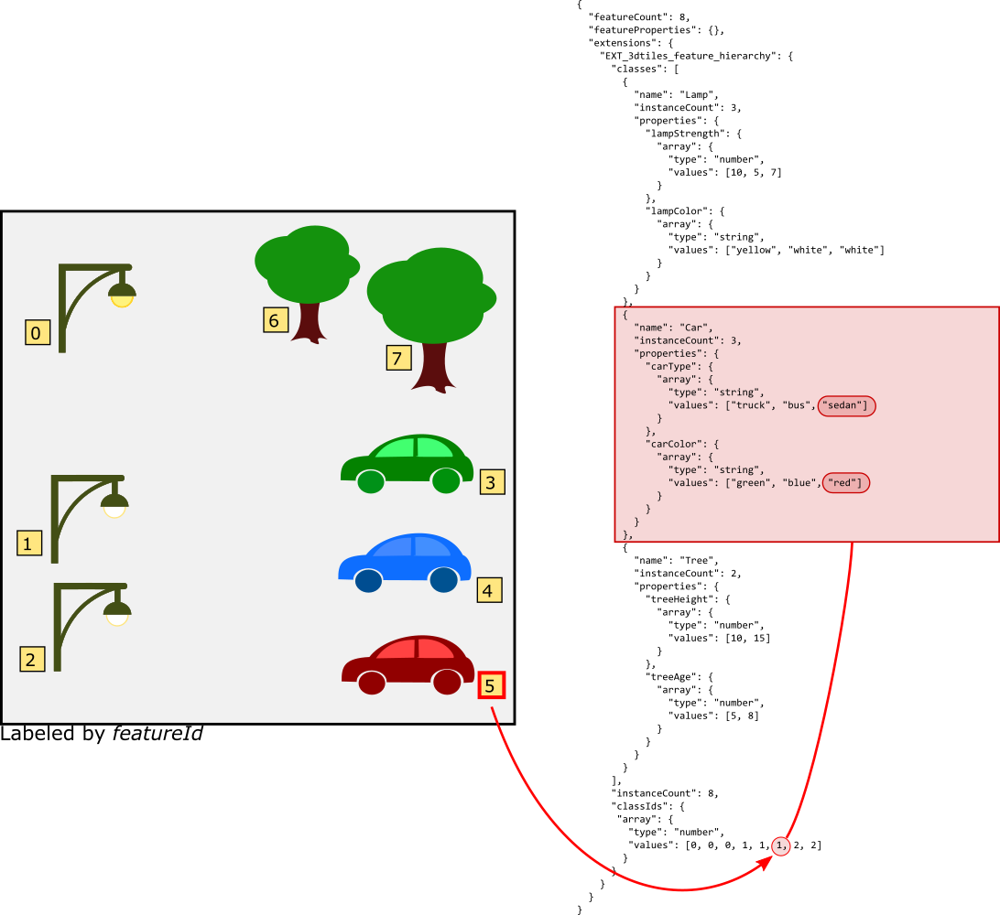
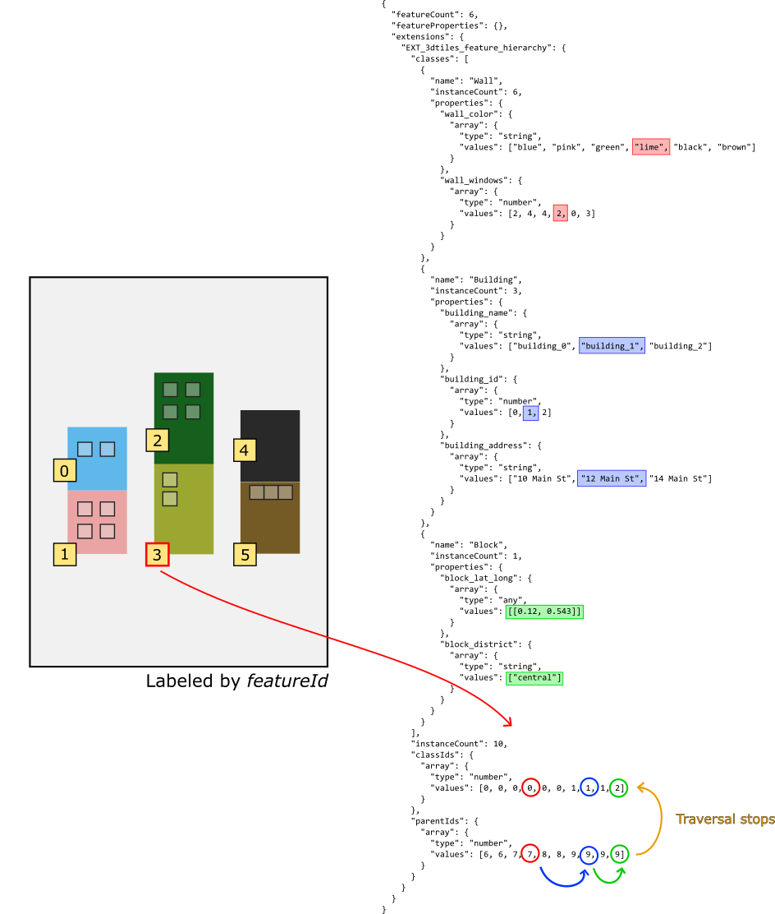

# EXT\_3dtiles\_feature\_hierarchy

## Contributors

* Sean Lilley, [@lilleyse](https://github.com/lilleyse)
* Patrick Cozzi, [@pjcozzi](https://twitter.com/pjcozzi)

## Status

Draft

## Dependencies

Written against the glTF 2.0 spec. Depends on `EXT_3dtiles_feature_metadata`.

## Overview

The standard feature table is suitable for datasets composed of features with the same sets of properties. However, some datasets have more complex metadata structures such as feature classes or feature hierarchies that are not easy to represent as parallel arrays of properties. The Feature Hierarchy extension provides more flexibility for these cases.

## Motivation

Consider a tile whose features fit into multiple categories that do not share the same properties. A parking lot tile may have three types of features: cars, lamp posts, and trees. With the standard feature table, this might look like the following:

```json
{
  "featureCount": 8,
  "featureProperties": {
    "lampStrength": {
      "array": {
        "type": "number",
        "values": [10, 5, 7, 0, 0, 0, 0, 0]
      }
    },
    "lampColor": {
      "array": {
        "type": "string",
        "values": ["yellow", "white", "white", "", "", "", "", ""]
      }
    },
    "carType": {
      "array": {
        "type": "string",
        "values": ["", "", "", "truck", "bus", "sedan", "", ""]
      }
    },
    "carColor": {
      "array": {
        "type": "string",
        "values": ["", "", "", "green", "blue", "red", "", ""]
      }
    },
    "treeHeight": {
      "array": {
        "type": "number",
        "values": [0, 0, 0, 0, 0, 0, 10, 15]
      }
    },
    "treeAge": {
      "array": {
        "type": "number",
        "values": [0, 0, 0, 0, 0, 0, 5, 8]
      }
    }
  }
}
```

In this example, several `""` and `0` array values are stored so each array has the same number of elements.  A potential workaround is to store properties as JSON objects; however, this becomes bulky as the number of properties grows:

```json
{
  "featureCount": 8,
  "featureProperties": {
    "info": {
      "array": {
        "type": "any",
        "values": [
          {
            "lampStrength": 10,
            "lampColor": "yellow"
          },
          {
            "lampStrength": 5,
            "lampColor": "white"
          },
          {
            "lampStrength": 7,
            "lampColor": "white"
          },
          {
            "carType": "truck",
            "carColor": "green"
          },
          {
            "carType": "bus",
            "carColor": "blue"
          },
          {
            "carType": "sedan",
            "carColor": "red"
          },
          {
            "treeHeight": 10,
            "treeAge": 5
          },
          {
            "treeHeight": 15,
            "treeAge": 8
          }
        ]
      }
    }
  }
}
```

Another limitation of the standard feature table is the difficulty in expressing metadata hierarchies. 
For example, consider a tile that represents a city block. The block itself contains metadata, the individual buildings contain metadata, and the building walls contain metadata. A tree diagram of the hierarchy might look like this:

- block
  - building
    - wall
    - wall
  - building
    - wall
    - wall
  - building
    - wall
    - wall


In order to select a wall and retrieve properties from its building, the wall metadata must also include building metadata. Essentially the three-level hierarchy must be flattened into each feature, resulting in a lot of duplicate entries.

A standard feature table with two walls per building and three buildings per block might look like this:

```json
{
  "featureCount": 6,
  "featureProperties": {
    "wall_color": {
      "array": {
        "type": "string",
        "values": ["blue", "pink", "green", "lime", "black", "brown"]
      }
    },
    "wall_windows": {
      "array": {
        "type": "number",
        "values": [2, 4, 4, 2, 0, 3]
      }
    },
    "building_name": {
      "array": {
        "type": "string",
        "values": ["building_0", "building_0", "building_1", "building_1", "building_2", "building_2"]
      }
    },
    "building_id": {
      "array": {
        "type": "number",
        "values": [0, 0, 1, 1, 2, 2]
      }
    },
    "building_address": {
      "array": {
        "type": "string",
        "values": ["10 Main St", "10 Main St", "12 Main St", "12 Main St", "14 Main St", "14 Main St"]
      }
    },
    "block_lat_long": {
      "array": {
        "type": "any",
        "values": [[0.12, 0.543], [0.12, 0.543], [0.12, 0.543], [0.12, 0.543], [0.12, 0.543], [0.12, 0.543]]
      }
    },
    "block_district": {
      "array": {
        "type": "string",
        "values": ["central", "central", "central", "central", "central", "central"]
      }
    }
  }
}
```

Both these cases illustrate the benefit of supporting feature classes and a feature hierarchy within the Feature Table.

## Feature Table updates

The standard feature table may be extended to include a `EXT_3dtiles_feature_hierarchy` object that defines a set of classes and a tree structure for class instances. This extension can only be added to feature tables where `featureCount` is defined since feature ids are required to index into the hierarchy.

Sample Feature Table:

```json
{
  "featureCount": 6,
  "featureProperties": {},
  "extensions": {
    "EXT_3dtiles_feature_hierarchy": {
      "classes": [
        {
          "name": "Wall",
          "instanceCount": 6,
          "properties": {
            "color": {
              "array": {
                "type": "string",
                "values": ["white", "red", "yellow", "gray", "brown", "black"]
              }
            }
          }
        },
        {
          "name": "Building",
          "instanceCount": 3,
          "properties": {
            "name": {
              "array": {
                "type": "string",
                "values": ["unit29", "unit20", "unit93"]
              }
            },
            "address": {
              "array": {
                "type": "string",
                "values": ["100 Main St", "102 Main St", "104 Main St"]
              }
            }
          }
        },
        {
          "name": "Owner",
          "instanceCount": 3,
          "properties": {
            "type": {
              "array": {
                "type": "string",
                "values": ["city", "resident", "commercial"]
              }
            },
            "id": {
              "array": {
                "type": "number",
                "values": [1120, 1250, 6445]
              }
            }
          }
        }
      ],
      "instanceCount": 12,
      "classIds": {
        "array": {
          "type": "number",
          "values": [0, 0, 0, 0, 0, 0, 1, 1, 1, 2, 2, 2]
        }
      },
      "parentCounts": {
        "array": {
          "type": "number",
          "values": [1, 3, 2, 1, 1, 1, 1, 1, 1, 0, 0, 0]
        }
      },
      "parentIds": {
        "array": {
          "type": "number",
          "values": [6, 6, 10, 11, 7, 11, 7, 8, 8, 10, 10, 9]
        }
      }
    }
  }
}
```

### EXT_3dtiles_feature_hierarchy

`classes` is an array of objects, where each object contains the following properties:
* `name` - A string representing the name of the class
* `instanceCount` - The number of instances of the class
* `properties` - An object containing instance properties. Like regular feature table properties, instance properties may be an array of values in JSON or a reference to binary data via an accessor. If using the array form, the array's length must equal `instanceCount`. If using the accessor form, `accessor.count` must equal `instanceCount`.

The top-level `instanceCount` is the total number of instances. It is equal to the sum of the `instanceCount` properties of the classes.

Note that this is different than `featureCount`, which is the total number of features. While all features are instances, not all instances are features; the hierarchy may contain instances that don't have a physical basis in the tile's geometry but still contribute to the hierarchy.

`classIds` is an array of integers of length `instanceCount`. Each value specifies the instance's class as an index in the `classes` array.

> **Implementation Note:** The feature hierarchy does not directly provide an instance's index into its class's `properties` array. Instead the index can be inferred by the number of instances with the same `classId` that have appeared before it. An implementation may want to compute these indices at load time so that property access is as fast as possible.

`parentCounts` is an array of integers of length `instanceCount`. Each value specifies the number of parents that instance has. If omitted, `parentCounts` is implicitly an array of length `instanceCount`, where all values are 1.

`parentIds` is an array of integers whose length equals the sum of the values in `parentCounts`. Parent ids are placed sequentially by instance - instance 0's parent ids are followed by instance 1's parent ids. Each value specifies the instance's parent as an index into the `classIds` array.

Cyclical hierarchies are not allowed. When an instance's `parentId` points to itself, then it has no parent. When `parentIds` is omitted, the instances do not have parents.

A feature's `featureId` is used to access its `classId` and `parentCount`. Therefore, the values in the `classIds` and `parentCounts` arrays are initially ordered by `featureId` and followed by non-feature instances.

The `parentCounts` and `parentIds` arrays form an instance hierarchy. A feature's properties include those defined by its own class and any properties from ancestor instances.

In some cases multiple ancestors may share the same property name. This can occur if two ancestors are the same class or are different classes with the same property names. For example, if every class defined the property "id", then it would be an overloaded property. In such cases it is up to the implementation to decide which value to return.

`classIds`, `parentCounts`, and `parentIds` may be be an array of values in JSON or a reference to binary data via an accessor. If using the array form, the array's length must equal `instanceCount`. If using the accessor form, `type` must be `SCALAR`, `componentType` must be `UNSIGNED_BYTE`, `UNSIGNED_SHORT`, or `UNSIGNED_INT`, and `count` must equal `instanceCount`.

```json
"classIds": {
  "accessor": 0
};
```

```json
"accessors": [
  {
    "bufferView": 0,
    "byteOffset": 0,
    "componentType": 5123,
    "count": 12,
    "type": "SCALAR"
  }
]
```

## Examples

### Feature classes

Going back to the example of a parking lot with car, lamp post, and tree features, a Feature Table might look like this:

```json
{
  "featureCount": 8,
  "featureProperties": {},
  "extensions": {
    "EXT_3dtiles_feature_hierarchy": {
      "classes": [
        {
          "name": "Lamp",
          "instanceCount": 3,
          "properties": {
            "lampStrength": {
              "array": {
                "type": "number",
                "values": [10, 5, 7]
              }
            },
            "lampColor": {
              "array": {
                "type": "string",
                "values": ["yellow", "white", "white"]
              }
            }
          }
        },
        {
          "name": "Car",
          "instanceCount": 3,
          "properties": {
            "carType": {
              "array": {
                "type": "string",
                "values": ["truck", "bus", "sedan"]
              }
            },
            "carColor": {
              "array": {
                "type": "string",
                "values": ["green", "blue", "red"]
              }
            }
          }
        },
        {
          "name": "Tree",
          "instanceCount": 2,
          "properties": {
            "treeHeight": {
              "array": {
                "type": "number",
                "values": [10, 15]
              }
            },
            "treeAge": {
              "array": {
                "type": "number",
                "values": [5, 8]
              }
            }
          }
        }
      ],
      "instanceCount": 8,
      "classIds": {
        "array": {
          "type": "number",
          "values": [0, 0, 0, 1, 1, 1, 2, 2]
        }
      }
    }
  }
}
```

Since this example does not contain any sort of hierarchy, the `parentCounts` and `parentIds` are not included, and `instanceCount` just equals `featureCount`.

A `classId` of 0 indicates a "Lamp" instance, 1 indicates a "Car" instance, and 2 indicates a "Tree" instance.

A feature's `featureId` is used to access its class in the `classIds` array. Features with a `featureId` of 0, 1, 2 are "Lamp" instances, features with a `featureId` of 3, 4, 5 are "Car" instances, and features with `featureId` of 6 and 7 are "Tree" instances.

The feature with `featureId = 5` is the third "Car" instance, and its properties are

```
carType: "sedan"
carColor: "red"
```

Feature hierarchy, parking lot:



### Feature hierarchy

The city block example would now look like this:

```json
{
  "featureCount": 6,
  "featureProperties": {},
  "extensions": {
    "EXT_3dtiles_feature_hierarchy": {
      "classes": [
        {
          "name": "Wall",
          "instanceCount": 6,
          "properties": {
            "wall_color": {
              "array": {
                "type": "string",
                "values": ["blue", "pink", "green", "lime", "black", "brown"]
              }
            },
            "wall_windows": {
              "array": {
                "type": "number",
                "values": [2, 4, 4, 2, 0, 3]
              }
            }
          }
        },
        {
          "name": "Building",
          "instanceCount": 3,
          "properties": {
            "building_name": {
              "array": {
                "type": "string",
                "values": ["building_0", "building_1", "building_2"]
              }
            },
            "building_id": {
              "array": {
                "type": "number",
                "values": [0, 1, 2]
              }
            },
            "building_address": {
              "array": {
                "type": "string",
                "values": ["10 Main St", "12 Main St", "14 Main St"]
              }
            }
          }
        },
        {
          "name": "Block",
          "instanceCount": 1,
          "properties": {
            "block_lat_long": {
              "array": {
                "type": "any",
                "values": [[0.12, 0.543]]
              }
            },
            "block_district": {
              "array": {
                "type": "string",
                "values": ["central"]
              }
            }
          }
        }
      ],
      "instanceCount": 10,
      "classIds": {
        "array": {
          "type": "number",
          "values": [0, 0, 0, 0, 0, 0, 1, 1, 1, 2]
        }
      },
      "parentIds": {
        "array": {
          "type": "number",
          "values": [6, 6, 7, 7, 8, 8, 9, 9, 9, 9]
        }
      }
    }
  }
}
```

`featureCount` is 6 and `instanceCount` is 10. The building and block instances are not features of the tile but contain properties that are inherited by the six wall features.

`parentCounts` is not included since every instance has at most one parent.

A feature with `featureId = 3` has the following properties:

```
wall_color: "lime"
wall_windows: 2
building_name: "building_1"
building_id: 1,
building_address: "12 Main St"
block_lat_long: [0.12, 0.543]
block_district: "central"
```

Breaking it down into smaller steps:

The feature with `featureId = 3` is the fourth "Wall" instance, and its properties are the following:
```
wall_color: "lime"
wall_windows: 2
```

The feature's `parentId` is 7, which is the second "Building" instance. Therefore it gets the following properties from its parent:
```
building_name: "building_1"
building_id: 1,
building_address: "12 Main St"
```

The building's `parentId` is 9, which is the sole "Block" instance with the following properties:
```
block_lat_long: [[0.12, 0.543]]
block_district: ["central"]
```

Since the block's `parentId` is also 9, it does not have a parent and the traversal is complete.

Feature hierarchy, block:



## Notes

* Since the feature hierarchy is an extension to the standard feature table, it is still possible to store per-feature properties alongside the `EXT_3dtiles_feature_hierarchy` extension object:

```
{
  "featureCount": 10,
  "featureProperties": {
    "Height": {
      "array": {
        "type": "number",
        "values": [...]
      }
    },
    "Longitude": {
      "array": {
        "type": "number",
        "values": [...]
      }
    },
    "Latitude": {
      "array": {
        "type": "number",
        "values": [...]
      }
    }
  },
  "extensions": {
    "EXT_3dtiles_feature_hierarchy": {...}
  }
}
```

## See Also

TODO

## glTF Schema Updates

TODO

## Known Implementations

TODO

## Examples

TODO