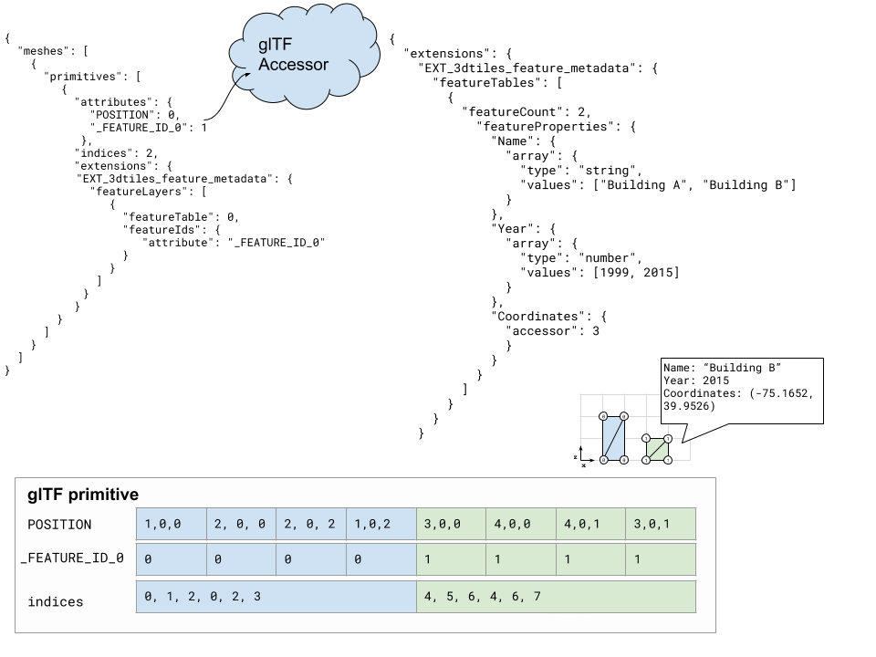

### ⚠️ `EXT_3dtiles_feature_metadata` has been replaced by [`EXT_mesh_features`](https://github.com/CesiumGS/glTF/tree/3d-tiles-next/extensions/2.0/Vendor/EXT_mesh_features) ⚠️

# EXT\_3dtiles\_feature\_metadata

## Contributors

* Sean Lilley, Cesium
* Samuel Vargas, Cesium
* Sam Suhag, Cesium
* Patrick Cozzi, Cesium

## Status

Draft

## Dependencies

Written against the glTF 2.0 spec. Depends on [`EXT_mesh_gpu_instancing`](https://github.com/KhronosGroup/glTF/pull/1691) for instanced features.

## Overview

**Features** are geometric entities in 3D space and may have application specific properties associated with them. These properties may span a myriad of domains, such as the heights of buildings in a city, the names of different structures in a CAD model, the classification of different points in a point cloud, or the age of different trees in a forest of instanced tree models. This extension adds a mechanism for storing an unlimited amount of feature metadata in a glTF asset and identifying features in the asset on a per-vertex or per-texel basis.

<p style="text-align: center">

</p>

The `EXT_3dtiles_feature_metadata` extension consists of **feature layers** and **feature tables**.

Feature layers are defined on a glTF primitive to specify how the vertices or texels in that primitive are mapped to features. In the diagram above, a glTF consists of two houses batched together into a single primitive. A feature layer defined on that primitive indicates that all of the vertices making up the first house have a feature ID of `0`, while all vertices making up the second house have the feature ID `1`.

A feature table, defined in the root-level `EXT_3dtiles_feature_metadata` extension object, then defines the properties (also known as attributes or metadata) associated with each of these features. In the diagram, each feature has an `address` property in the feature table.

A single primitive may have multiple feature layers, allowing, for example, the roof, doors, and windows of the buildings to also be treated as separate features with their own properties. A single feature table may also be shared among multiple primitives.

Splitting feature layers and feature tables into distinct categories makes this extension flexible and space-efficient. A vertex or texel in a primitive can be associated with multiple different properties simultaneously; no data duplication is necessary. For example, a group of points in a point cloud could represent specific areas of a building by name **and** also have per-vertex intensity data associated with them. Multiple feature layers and feature tables also facilitate heterogeneous mesh data to be combined into a single glTF asset.

The `EXT_3dtiles_feature_hierarchy` extension can be used to extend feature tables to support feature classes and hierarchies as well.

|| |
|----|---|
|Left: A point cloud with two feature tables, one storing per-group properties and the other storing per-point properties.|Right: A glTF containing a 3D mesh (house), a point cloud (tree), and instanced models (fencing) with three feature tables.|

## Example

The following example is a feature table with a mix of JSON and binary property accessors.

<p>

</p>

```json
{
  "meshes": [
    {
      "primitives": [
        {
          "attributes": {
            "POSITION": 0,
            "_FEATURE_ID_0": 1
          },
          "indices": 2,
          "extensions": {
            "EXT_3dtiles_feature_metadata": {
              "featureLayers": [
                {
                  "featureTable": 0,
                  "featureIds": {
                    "attribute": "_FEATURE_ID_0"
                  }
                }
              ]
            }
          }
        }
      ]
    }
  ],
  "extensions": {
    "EXT_3dtiles_feature_metadata": {
      "featureTables": [
        {
          "featureCount": 2,
          "featureProperties": {
            "Name": {
              "array": {
                "type": "string",
                "values": ["Building A", "Building B"]
              }
            },
            "Year": {
              "array": {
                "type": "number",
                "values": [1999, 2015]
              }
            },
            "Coordinates": {
              "accessor": 3
            }
          }
        }
      ]
    }
  },
  "accessors": [
    {
      "name": "Positions",
      "bufferView": 0,
      "byteOffset": 0,
      "componentType": 5126,
      "count": 8,
      "type": "VEC3"
    },
    {
      "name": "Feature IDs",
      "bufferView": 1,
      "byteOffset": 0,
      "componentType": 5126,
      "count": 8,
      "type": "SCALAR"
    },
    {
      "name": "Indices",
      "bufferView": 2,
      "byteOffset": 0,
      "componentType": 5123,
      "count": 12,
      "type": "SCALAR"
    },
    {
      "name": "Coordinates (longitude, latitude)",
      "bufferView": 3,
      "byteOffset": 0,
      "componentType": 5126,
      "count": 2,
      "type": "VEC2",
      "max": [180, 90],
      "min": [-180, -90]
    }
  ]
}
```

## Concepts

### Feature Layers

Feature layers are per-primitive and define the mapping between vertices / texels and feature property data. They must always reference a feature table and may also encode feature property data directly. They contain the following properties:

| Property            | Description                                                       | Caveats                                 |
|---------------------|-------------------------------------------------------------------|-----------------------------------------|
| `featureTable`      | Index of the feature table that this feature layer is using.      |                                         |
| `featureIds`        | Indirect accessor to feature IDs for the specified feature table. | Cannot be used with `featureProperties` |
| `featureProperties` | An object describing how to access feature properties.            | Cannot be used with `featureIds`        |

### Property Data Accessing

<p>

</p>

The `featureTable` index and looked up feature IDs are used in conjunction with each other to access the per-vertex / per-texel feature property data. For example, to find the year `Building A` was constructed:

1. Read the first feature layer.
2. Observe that the first feature layer uses the zeroth feature table.
3. Observe that this feature layer is using per-vertex feature IDs, (`{attribute: _FEATURE_ID_0}`)
4. Go to `_FEATURE_ID_0` in the primitive's `attributes` section to find a reference to a glTF accessor for the per-vertex feature IDs.
5. After using the accessor / buffer view to access the feature IDs, observe that the first four feature IDs are `0`, and the second four feature IDs are `1`.
6. For each feature ID, go to the specified feature table and use the feature ID as an index into the provided `values` or `accessor` data. The first four vertices belong to `Building A` and were constructed in `1999`. The last four vertices belong to `Building B` and were constructed in 2015. `Coordinates` requires the feature data to be indirectly accessed via a glTF accessor reference (`3`), but the feature IDs can be used as indices into the `Coordinates` data once it is decoded.

#### Feature IDs

As shown in the [above example](#property-data-accessing), feature IDs are used as an index to establish the relationship between feature property data and a vertex / texel. The `featureIds` object in a primitive describes the type of feature property data association (if it's on a per-vertex or per-texel basis) and which attribute / texture contains the feature ID data. Feature IDs must always exist in the range `[0, featureCount - 1]`, where `featureCount` is the maximum length of the feature property data arrays for the specified feature table (see [Feature Tables](#feature-table)).


| Property          | Description                                            | Caveats                                 |
|-------------------|--------------------------------------------------------|-----------------------------------------|
| `attribute`       | The name of a vertex attribute in this primitive containing feature IDs  | Cannot be used with `textureAccessor` |
| `textureAccessor` | A view into a texture containing feature IDs           | Cannot be used with `attribute`         |
| `instanceStride`  | Optional property specifying per-instance stride to apply to feature IDs when the mesh is instanced by the `EXT_mesh_gpu_instancing` extension. Set `instanceStride` to 1 and initialize `attribute`'s accessor with zeros (e.g. by not defining `bufferView`) to treat each instance as a separate feature. Explicit feature IDs and custom strides may provide a lower level of feature granularity if desired. ||

Note that `attribute` and `textureAccessor` are mutually exclusive. Per-vertex and per-texel feature IDs cannot be used in the same feature layer.

###### Feature ID semantic

The extension adds a new indexed attribute semantic, `_FEATURE_ID_0`. This attribute should be used for per-vertex feature IDs. All `_FEATURE_ID_X` indices must start with zero and be continuous positive integers. e.g (`_FEATURE_ID_0`, `_FEATURE_ID_1`, `_FEATURE_ID_2`). The attribute's accessor `type` must be `"SCALAR"` and `normalized` must be false. There is no restriction on `componentType` to facilitate different byte alignments for the feature ID accessor, but note that the feature IDs must be **whole** numbers. Finally, feature ID values must be in the range `[0, featureCount - 1]`.

###### Example

An example of two feature layers with per-vertex feature IDs:

```json
{
  "primitives": [
    {
      "attributes": {
        "POSITION": 0,
        "_FEATURE_ID_0": 1,
        "_FEATURE_ID_1": 2
      },
      "indices": 3,
      "extensions": {
        "EXT_3dtiles_feature_metadata": {
          "featureLayers": [
            {
              "featureTable": 0,
              "featureIds": {
                "attribute": "_FEATURE_ID_0"
              }
            },
            {
              "featureTable": 1,
              "featureIds": {
                "attribute": "_FEATURE_ID_1"
              }
            }
          ]
        }
      }
    }
  ]
}
```

##### Per-texel feature IDs

Feature ids can be stored in a texture and accessed with a [`textureAccessor`](#texture-accessor).

For a given point on the mesh's surface, the feature ID is sampled from the feature ID texture using the interpolated texture coordinates of the given `TEXCOORD` set, just like in traditional texture mapping.

The `textureAccessor`'s `channels` string must be of length one and `normalized` must be false (default). The texture's sampler must use nearest neighbor filtering - i.e. `minFilter` and `magFilter` must be `9728` (`NEAREST`).

##### Texture Accessor

Texture accessors contain a reference to a glTF texture plus additional information on how to access its values. They can be used for both per-texel feature IDs and per-texel properties.

| Property | Description | Caveats
|--|--|--|
|`texture`  | A [`textureInfo`](../../../../specification/2.0/README.md#textureinfo) object |  |
|`channels`  | A string matching the pattern `/^(?=[rgba]{1,4}$)(?!.*(.).*\1).*$/` (Any permutation of `rgba` that doesn't repeat channels). This channel string also implicitly defines the `type` (`"SCALAR"`, `"VEC2"`, `"VEC3"`, `"VEC4"`) that the per-texel property data is encoded as (per-texel feature IDs must always be encoded as `"SCALAR"`). | If the texture does not contain a particular color channel then the maximum value must be returned (e.g. 255 for 8-bit color depth). If the texture accessor is being used to access per-texel feature IDs, then the channel string must match the regex `/^[rgba]{1}$/` and `normalized` must be false (the default). |  |
|`normalized`  | Whether the texture should be normalized to the `[0.0, 1.0]` range. This property overrides the normalization specified in the native image format (e.g. if `normalized` is true, and the KTX2 image format is `VK_FORMAT_R8_UNORM` the values will still be normalized.) |  |

Example: read data from a grayscale texture and normalize to the `[0.0, 1.0]` range.

```json
{
  "texture": {
    "index": 0
  },
  "channels": "r",
  "normalized": true
}
```

##### Per-texel feature IDs example

```json
{
  "primitives": [
    {
      "attributes": {
        "POSITION": 0,
        "TEXCOORD_0": 1
      },
      "indices": 2,
      "extensions": {
        "EXT_3dtiles_feature_metadata": {
          "featureLayers": [
            {
              "featureTable": 0,
              "featureIds": {
                "textureAccessor": {
                  "texture": {
                    "texCoord": 0,
                    "index": 0
                  },
                  "channels": "r"
                }
              }
            }
          ]
        }
      }
    }
  ]
}
```

#### Feature properties

If each vertex or texel has a unique data property associated with it, then it is wasteful to create an intermediary list of feature IDs for vertices / texels. The `EXT_3dtiles_feature_metadata` extension supports this use case via the `featureProperties` object inside of a primitive. This object is similar to the `featureIds` object but directly establishes a one-to-one correspondence between **each** vertex / texel, and the associated property data.

| Property          | Description                                            | Caveats                                 |
|-------------------|--------------------------------------------------------|-----------------------------------------|
| `attribute`       | An attribute in this primitive that references property data with a one-to-one correspondence with vertex data. | Cannot be used with `textureAccessor`.  |
| `textureAccessor` | A view into a texture containing property data with a one-to-one correspondence with texel data. | Cannot be used with `attribute`. All `texCoord` values must be the same within a feature layer. |

Note that `featureProperties` must contain an entry for each property in the layer's feature table and `featureProperties` cannot mix per-vertex and per-texel properties.

##### Examples

Per-vertex properties:

```json
{
  "primitives": [
    {
      "attributes": {
        "POSITION": 0,
        "_TEMPERATURE": 1,
        "_INTENSITY:": 2
      },
      "indices": 3,
      "extensions": {
        "EXT_3dtiles_feature_metadata": {
          "featureLayers": [
            {
              "featureTable": 0,
              "featureProperties": {
                "Temperature": {
                  "attribute": "_TEMPERATURE"
                },
                "Intensity": {
                  "attribute": "_INTENSITY"
                }
              }
            }
          ]
        }
      }
    }
  ]
}
```

Per-texel properties:

```json
{
  "primitives": [
    {
      "attributes": {
        "POSITION": 0,
        "TEXCOORD_0": 1
      },
      "indices": 2,
      "extensions": {
        "EXT_3dtiles_feature_metadata": {
          "featureLayers": [
            {
              "featureTable": 0,
              "featureProperties": {
                "Temperature": {
                  "textureAccessor": {
                    "texture": {
                      "texCoord": 0,
                      "index": 0
                    },
                    "channels": "r",
                    "normalized": false
                  }
                },
                "Intensity": {
                  "textureAccessor": {
                    "texture": {
                      "texCoord": 0,
                      "index": 1
                    },
                    "channels": "r",
                    "normalized": true
                  }
                }
              }
            }
          ]
        }
      }
    }
  ]
}
```

### Feature Table

Feature tables store feature property data directly (as a collection of valid JSON data types) or provide references to glTF accessors where the feature property data can be indirectly accessed. They may also contain references to per-vertex or per-texel [feature properties](#feature-properties) with additional metadata about the `componentType` / `type` / `normalized` status of the feature property data. Feature tables are split into two subcategories: `Value` feature tables are feature tables that refer to data that must be indexed using feature IDs. `Descriptor` feature tables are feature tables that refer to per-vertex or per-texel data that does not use feature IDs for indexing.

#### Value Tables

`Value` feature tables may encode feature property data directly or refer to glTF accessors with the necessary data. They require feature IDs to associate a given vertex or texel with property data.

##### Encoding Property Data Directly in Value Tables

`Value` feature tables directly encode feature property data or provide references to glTF accessors. Consider the following example:

```json
{
  "extensions": {
    "EXT_3dtiles_feature_metadata": {
      "featureTables": [
        {
          "featureCount": 2,
          "featureProperties": {
            "Name": {
              "semantic": "_COLOR",
              "array": {
                "type": "string",
                "values": ["Cyan", "Yellow"]
              }
            }
          }
        }
      ]
    }
  }
}
```

* The `featureCount` key is required and specifies how many elements each feature property data array contains. All feature property data arrays **must** have the same length.
* The `class` key is optional and associates the feature table with an application-specific class name.
* The [semantic](#property-semantic) key is optional and provides context for the purpose of the property.
* Property data can be directly encoded via an `array: { … }` section in a `Value` feature table.
  * The `type` is optional and must be one of the following: `"string"`, `"number"`, `"boolean"`, or `"any"`. When not supplied, the default type is `"any"`.
  * The `any` type should be used if the array contains nested arrays, objects, nulls, or heterogeneous data types.
  * `values` must be an array of elements of the aforementioned types. The array length must be equal to `featureCount`.

##### Encoding Property Data in Value Tables as glTF Accessors

```json
{
  "extensions": {
    "EXT_3dtiles_feature_metadata": {
      "featureTables": [
        {
          "class": "Building",
          "featureCount": 2,
          "featureProperties": {
            "Location": {
              "semantic": "_LOCATION",
              "accessor": 3
            }
          }
        }
      ]
    }
  }
}
```

* `featureCount` is required and specifies how many elements each referenced glTF accessor must contain. In this example, the glTF accessor at index 3 must have a `count` of `2` to satisfy this requirement.
* The `accessor` keyword is required and must refer to a glTF accessor containing feature ID indexable property data.

#### Encoding Property Metadata in Descriptor Tables

`Descriptor` feature tables contains property metadata about feature property data with a one-to-one correspondence to vertices or texels. They differ from `Value` feature tables in that `featureCount` should be omitted, and that they only contain information on how to interpret the feature property data, not on how to access it. The primitive contains the reference to the actual glTF accessor or texture containing the desired feature property data.

```json
{
  "extensions": {
    "EXT_3dtiles_feature_metadata": {
      "featureTables": [
        {
          "featureProperties": {
            "Intensity": {
              "descriptor": {
                "componentType": 5123,
                "type": "SCALAR",
                "normalized": true
              }
            }
          }
        }
      ]
    }
  }
```

* `featureCount` should not be present in a `Descriptor` table.
* `componentType` is required and should be a glTF [component type](../../../../specification/2.0#accessorcomponenttype-white_check_mark).
* `type` is required and should be a glTF [type](../../../../specification/2.0#accessortype-white_check_mark).
* `normalized` is an optional boolean (default: `false`) and specifies if the data should be normalized to the range `[0.0, 1.0]`.

These three properties **must** match the values in their corresponding glTF primitive attribute accessors. Additionally, if the referenced data is per-texel, then:

* `type` **must** match the specified channels for the texture.
* `componentType` **must** correspond to the texture's bit depth and signedness.

Examples of illegal scenarios for per-texel descriptors include but are not limited to:

* Specifying a `VEC2` for the `type` but the channels are `"rgb"`.
* Specifying a `componentType` of `UNSIGNED_SHORT` but the texture is 8-bits per channel.

#### Property `semantic`

Properties in feature tables may also define an optional `semantic.` This is an enumerated value that describes how the property should be interpreted. The `EXT_3dtiles_feature_metadata` extension provides the following built-in semantics:

| Semantic | Type | Description |
|----------|------|-------------|
|`NAME`|`string`| The name of the feature. Names do not have to be unique.|
|`ID`|`number` or `string`|A unique identifier for this feature.|

Application-specific semantics may also be defined, with the caveat that they must begin with an underscore, e.g. `_CLASSIFICATION`. Semantics must be unique within an individual feature table.

Example feature table with built-in and application-specific semantics:

```json
{
  "featureCount": 4,
  "featureProperties": {
    "bldg_name": {
      "semantic": "NAME",
      "array": {
        "type": "string",
        "values": ["House", "Store", "Bank", "House"]
      }
    },
    "bldg_uuid": {
      "semantic": "ID",
      "array": {
        "type": "string",
        "values": [
          "752ac29d-c262-473b-bd85-aff3c471f3c8",
          "c3006d52-099a-4c05-95a1-a91a1be71f0e",
          "9e011aa9-0ed9-497c-923f-0bed8c286134",
          "cd876cc5-f2d3-400b-ad64-f5dee35f0520"
        ]
      }
    },
    "bldg_classif": {
      "semantic": "_CLASSIFICATION",
      "array": {
        "type": "number",
        "values": [0, 1, 2, 0]
      }
    }
  }
}
```

#### Property `extras`

Store additional application-specific metadata about the property in its `extras` object:

```json
{
  "featureCount": 10,
  "featureProperties": {
    "ClassificationIds": {
      "accessor": 0,
      "extras": {
        "version": "1.4"
      }
    }
  }
}
```

```json
{
  "featureProperties": {
    "Accuracy": {
      "descriptor": {
        "type": "SCALAR",
        "componentType": 5121,
        "normalized": false
      },
      "extras": {
        "Offset": 0.1,
        "Gain": 20.0
      }
    }
  }
}
```

## Optional vs. Required

This extension is optional, meaning it should be placed in the glTF root's `extensionsUsed` list, but not in the `extensionsRequired` list.

## See Also

TODO

## glTF Schema Updates

TODO

## Known Implementations

TODO

## Additional Examples

### Two building features with JSON properties

```json
{
  "accessors": [
    {
      "name": "Positions",
      "bufferView": 0,
      "byteOffset": 0,
      "componentType": 5126,
      "count": 8,
      "type": "VEC3"
    },
    {
      "name": "Feature IDs",
      "bufferView": 1,
      "byteOffset": 0,
      "componentType": 5126,
      "count": 8,
      "type": "SCALAR"
    },
    {
      "name": "Indices",
      "bufferView": 2,
      "byteOffset": 0,
      "componentType": 5123,
      "count": 12,
      "type": "SCALAR"
    }
  ],
  "meshes": [
    {
      "primitives": [
        {
          "attributes": {
            "POSITION": 0,
            "_FEATURE_ID_0": 1
          },
          "indices": 2,
          "material": 0,
          "mode": 4,
          "extensions": {
            "EXT_3dtiles_feature_metadata": {
              "featureLayers": [
                {
                  "featureTable": 0,
                  "featureIds": {
                    "attribute": "_FEATURE_ID_0"
                  }
                }
              ]
            }
          }
        }
      ]
    }
  ],
  "extensionsUsed": [
    "EXT_3dtiles_feature_metadata"
  ],
  "extensions": {
    "EXT_3dtiles_feature_metadata": {
      "featureTables": [
        {
          "featureCount": 2,
          "featureProperties": {
            "Name": {
              "array": {
                "type": "string",
                "values": ["Building A", "Building B"]
              }
            },
            "Year": {
              "array": {
                "type": "number",
                "values": [1999, 2015]
              }
            },
            "Address": {
              "array": {
                "type": "any",
                "values": [
                  {
                    "Street": "Main Street",
                    "HouseNumber": "1"
                  },
                  {
                    "Street": "Main Street",
                    "HouseNumber": "2"
                  }
                ]
              }
            }
          }
        }
      ]
    }
  }
}
```

### Two building features with binary properties

```json
{
  "accessors": [
    {
      "name": "Positions",
      "bufferView": 0,
      "byteOffset": 0,
      "componentType": 5126,
      "count": 8,
      "type": "VEC3"
    },
    {
      "name": "Feature Ids",
      "bufferView": 1,
      "byteOffset": 0,
      "componentType": 5126,
      "count": 8,
      "type": "SCALAR"
    },
    {
      "name": "Indices",
      "bufferView": 2,
      "byteOffset": 0,
      "componentType": 5123,
      "count": 12,
      "type": "SCALAR"
    },
    {
      "name": "Ids",
      "bufferView": 3,
      "byteOffset": 0,
      "componentType": 5125,
      "count": 2,
      "type": "SCALAR"
    },
    {
      "name": "Coordinates",
      "bufferView": 4,
      "byteOffset": 0,
      "componentType": 5126,
      "count": 2,
      "type": "VEC2"
    }
  ],
  "meshes": [
    {
      "primitives": [
        {
          "attributes": {
            "POSITION": 0,
            "_FEATURE_ID_0": 1
          },
          "indices": 2,
          "material": 0,
          "mode": 4,
          "extensions": {
            "EXT_3dtiles_feature_metadata": {
              "featureLayers": [
                {
                  "featureTable": 0,
                  "featureIds": {
                    "attribute": "_FEATURE_ID_0"
                  }
                }
              ]
            }
          }
        }
      ]
    }
  ],
  "extensionsUsed": [
    "EXT_3dtiles_feature_metadata"
  ],
  "extensions": {
    "EXT_3dtiles_feature_metadata": {
      "featureTables": [
        {
          "featureCount": 2,
          "featureProperties": {
            "Id": {
              "accessor": 3
            },
            "Coordinates": {
              "accessor": 4
            }
          }
        }
      ]
    }
  }
}
```

### Point cloud with per-point properties

```json
{
  "accessors": [
    {
      "name": "Positions",
      "bufferView": 0,
      "byteOffset": 0,
      "componentType": 5126,
      "count": 8,
      "type": "VEC3"
    },
    {
      "name": "Colors",
      "bufferView": 1,
      "byteOffset": 0,
      "componentType": 5121,
      "count": 8,
      "stride": 4,
      "type": "VEC3"
    },
    {
      "name": "Intensity",
      "bufferView": 3,
      "byteOffset": 0,
      "componentType": 5123,
      "count": 8,
      "type": "SCALAR",
      "normalized": true
    },
    {
      "name": "Classification",
      "bufferView": 4,
      "byteOffset": 0,
      "componentType": 5121,
      "count": 8,
      "type": "SCALAR"
    }
  ],
  "meshes": [
    {
      "primitives": [
        {
          "attributes": {
            "POSITION": 0,
            "COLOR_0": 1,
            "_INTENSITY": 2,
            "_CLASSIFICATION": 3
          },
          "mode": 0,
          "extensions": {
            "EXT_3dtiles_feature_metadata": {
              "featureLayers": [
                {
                  "featureTable": 0,
                  "featureProperties": {
                    "Intensity": {
                      "attribute": "_INTENSITY"
                    },
                    "Classification": {
                      "attribute": "_CLASSIFICATION"
                    }
                  }
                }
              ]
            }
          }
        }
      ]
    }
  ],
  "extensionsUsed": [
    "EXT_3dtiles_feature_metadata"
  ],
  "extensions": {
    "EXT_3dtiles_feature_metadata": {
      "featureTables": [
        {
          "featureProperties": {
            "Intensity": {
              "descriptor": {
                "componentType": 5123,
                "type": "SCALAR",
                "normalized": true
              }
            },
            "Classification": {
              "descriptor": {
                "componentType": 5121,
                "type": "SCALAR"
              }
            }
          }
        }
      ]
    }
  }
}
```

### Point cloud with per-point properties and per-group properties

```json
{
  "accessors": [
    {
      "name": "Positions",
      "bufferView": 0,
      "byteOffset": 0,
      "componentType": 5126,
      "count": 8,
      "type": "VEC3"
    },
    {
      "name": "Colors",
      "bufferView": 1,
      "byteOffset": 0,
      "componentType": 5121,
      "count": 8,
      "stride": 4,
      "type": "VEC3"
    },
    {
      "name": "Feature IDs",
      "bufferView": 2,
      "byteOffset": 0,
      "componentType": 5126,
      "count": 8,
      "type": "SCALAR"
    },
    {
      "name": "Intensity",
      "bufferView": 3,
      "byteOffset": 0,
      "componentType": 5123,
      "count": 8,
      "type": "SCALAR",
      "normalized": true
    },
    {
      "name": "Classification",
      "bufferView": 4,
      "byteOffset": 0,
      "componentType": 5121,
      "count": 8,
      "type": "SCALAR"
    },
    {
      "name": "Id",
      "bufferView": 5,
      "byteOffset": 0,
      "componentType": 5125,
      "count": 2,
      "type": "SCALAR"
    },
    {
      "name": "Coordinates",
      "bufferView": 6,
      "byteOffset": 0,
      "componentType": 5126,
      "count": 2,
      "type": "VEC2"
    }
  ],
  "meshes": [
    {
      "primitives": [
        {
          "attributes": {
            "POSITION": 0,
            "COLOR_0": 1,
            "_FEATURE_ID_0": 2,
            "_INTENSITY": 3,
            "_CLASSIFICATION": 4
          },
          "mode": 0,
          "extensions": {
            "EXT_3dtiles_feature_metadata": {
              "featureLayers": [
                {
                  "featureTable": 0,
                  "featureProperties": {
                    "Intensity": {
                      "attribute": "_INTENSITY"
                    },
                    "Classification": {
                      "attribute": "_CLASSIFICATION"
                    }
                  }
                },
                {
                  "featureTable": 1,
                  "featureIds": {
                    "attribute": "_FEATURE_ID_0"
                  }
                }
              ]
            }
          }
        }
      ]
    }
  ],
  "extensionsUsed": [
    "EXT_3dtiles_feature_metadata"
  ],
  "extensions": {
    "EXT_3dtiles_feature_metadata": {
      "featureTables": [
        {
          "featureProperties": {
            "Intensity": {
              "descriptor": {
                "componentType": 5123,
                "type": "SCALAR",
                "normalized": true
              }
            },
            "Classification": {
              "descriptor": {
                "componentType": 5121,
                "type": "SCALAR"
              }
            }
          }
        },
        {
          "featureCount": 2,
          "featureProperties": {
            "Id": {
              "accessor": 5
            },
            "Coordinates": {
              "accessor": 6
            }
          }
        }
      ]
    }
  }
}
```

### Single feature example

```json
{
  "accessors": [
    {
      "name": "Positions",
      "bufferView": 0,
      "byteOffset": 0,
      "componentType": 5126,
      "count": 4,
      "type": "VEC3"
    },
    {
      "name": "Feature Ids",
      "componentType": 5126,
      "count": 4,
      "type": "SCALAR"
    },
    {
      "name": "Indices",
      "bufferView": 1,
      "byteOffset": 0,
      "componentType": 5123,
      "count": 6,
      "type": "SCALAR"
    }

  ],
  "meshes": [
    {
      "primitives": [
        {
          "attributes": {
            "POSITION": 0,
            "_FEATURE_ID_0": 1
          },
          "indices": 2,
          "material": 0,
          "mode": 4,
          "extensions": {
            "EXT_3dtiles_feature_metadata": {
              "featureLayers": [
                {
                  "featureTable": 0,
                  "featureIds": {
                    "attribute": "_FEATURE_ID_0"
                  }
                }
              ]
            }
          }
        }
      ]
    }
  ],
  "extensionsUsed": [
    "EXT_3dtiles_feature_metadata"
  ],
  "extensions": {
    "EXT_3dtiles_feature_metadata": {
      "featureTables": [
        {
          "featureCount": 1,
          "featureProperties": {
            "Name": {
              "array": {
                "type": "string",
                "values": ["Building name"]
              }
            }
          }
        }
      ]
    }
  }
}
```

### Composite example

```json
{
  "accessors": [
    {
      "name": "Point positions",
      "bufferView": 0,
      "byteOffset": 0,
      "componentType": 5126,
      "count": 8,
      "type": "VEC3"
    },
    {
      "name": "Point colors",
      "bufferView": 1,
      "byteOffset": 0,
      "componentType": 5121,
      "count": 8,
      "stride": 4,
      "type": "VEC3"
    },
    {
      "name": "Point feature Ids",
      "bufferView": 2,
      "byteOffset": 0,
      "componentType": 5126,
      "count": 8,
      "type": "SCALAR"
    },
    {
      "name": "Intensity",
      "bufferView": 3,
      "byteOffset": 0,
      "componentType": 5123,
      "count": 8,
      "type": "SCALAR",
      "normalized": true
    },
    {
      "name": "Classification",
      "bufferView": 4,
      "byteOffset": 0,
      "componentType": 5121,
      "count": 8,
      "type": "SCALAR"
    },
    {
      "name": "Id",
      "bufferView": 5,
      "byteOffset": 0,
      "componentType": 5125,
      "count": 2,
      "type": "SCALAR"
    },
    {
      "name": "Coordinates",
      "bufferView": 6,
      "byteOffset": 0,
      "componentType": 5126,
      "count": 2,
      "type": "VEC2"
    },
    {
      "name": "Positions",
      "bufferView": 7,
      "byteOffset": 0,
      "componentType": 5126,
      "count": 8,
      "type": "VEC3"
    },
    {
      "name": "Feature IDs",
      "bufferView": 8,
      "byteOffset": 0,
      "componentType": 5126,
      "count": 8,
      "type": "SCALAR"
    },
    {
      "name": "Indices",
      "bufferView": 9,
      "byteOffset": 0,
      "componentType": 5123,
      "count": 12,
      "type": "SCALAR"
    }
  ],
  "meshes": [
    {
      "primitives": [
        {
          "name": "Point cloud",
          "attributes": {
            "POSITION": 0,
            "COLOR_0": 1,
            "_FEATURE_ID_0": 2,
            "_INTENSITY": 3,
            "_CLASSIFICATION": 4
          },
          "mode": 0,
          "extensions": {
            "EXT_3dtiles_feature_metadata": {
              "featureLayers": [
                {
                  "featureTable": 0,
                  "featureProperties": {
                    "Intensity": {
                      "attribute": "_INTENSITY"
                    },
                    "Classification": {
                      "attribute": "_CLASSIFICATION"
                    }
                  }
                },
                {
                  "featureTable": 1,
                  "featureIds": {
                    "attribute": "_FEATURE_ID_0"
                  }
                }
              ]
            }
          }
        },
        {
          "name": "Buildings",
          "attributes": {
            "POSITION": 7,
            "_FEATURE_ID_0": 8
          },
          "indices": 9,
          "material": 0,
          "mode": 4,
          "extensions": {
            "EXT_3dtiles_feature_metadata": {
              "featureLayers": [
                {
                  "featureTable": 2,
                  "featureIds": {
                    "attribute": "_FEATURE_ID_0"
                  }
                }
              ]
            }
          }
        }
      ]
    }
  ],
  "extensionsUsed": [
    "EXT_3dtiles_feature_metadata"
  ],
  "extensions": {
    "EXT_3dtiles_feature_metadata": {
      "featureTables": [
        {
          "featureProperties": {
            "Intensity": {
              "descriptor": {
                "componentType": 5123,
                "type": "SCALAR",
                "normalized": true
              }
            },
            "Classification": {
              "descriptor": {
                "componentType": 5121,
                "type": "SCALAR"
              }
            }
          }
        },
        {
          "featureCount": 2,
          "featureProperties": {
            "Id": {
              "accessor": 5
            },
            "Coordinates": {
              "accessor": 6
            }
          }
        },
        {
          "featureCount": 2,
          "featureProperties": {
            "Name": {
              "array": {
                "type": "string",
                "values": ["Building A", "Building B"]
              }
            }
          }
        }
      ]
    }
  }
}
```

### Instancing example

```json
{
  "nodes": [
    {
      "mesh": 0,
      "extensions": {
        "EXT_mesh_gpu_instancing": {
          "attributes": {
            "TRANSLATION": 4
          }
        }
      }
    }
  ],
  "accessors": [
    {
      "name": "Positions",
      "bufferView": 0,
      "byteOffset": 0,
      "componentType": 5126,
      "count": 12,
      "type": "VEC3"
    },
    {
      "name": "Implicit Feature IDs",
      "componentType": 5126,
      "count": 12,
      "type": "SCALAR"
    },
    {
      "name": "Explicit Feature IDs",
      "bufferView": 1,
      "byteOffset": 0,
      "componentType": 5126,
      "count": 12,
      "type": "SCALAR"
    },
    {
      "name": "Indices",
      "bufferView": 2,
      "byteOffset": 0,
      "componentType": 5123,
      "count": 18,
      "type": "SCALAR"
    },
    {
      "name": "Per-Instance TRANSLATION",
      "bufferView": 3,
      "byteOffset": 0,
      "componentType": 5126,
      "count": 2,
      "type": "VEC3"
    }
  ],
  "meshes": [
    {
      "primitives": [
        {
          "attributes": {
            "POSITION": 0,
            "_FEATURE_ID_0": 1,
            "_FEATURE_ID_1": 2
          },
          "indices": 3,
          "extensions": {
            "EXT_3dtiles_feature_metadata": {
              "featureLayers": [
                {
                  "featureTable": 0,
                  "featureIds": {
                    "instanceStride": 1,
                    "attribute": "_FEATURE_ID_0"
                  }
                },
                {
                  "featureTable": 1,
                  "featureIds": {
                    "instanceStride": 6,
                    "attribute": "_FEATURE_ID_1"
                  }
                }
              ]
            }
          }
        }
      ]
    }
  ],
  "extensions": {
    "EXT_3dtiles_feature_metadata": {
      "featureTables": [
        {
          "featureCount": 2,
          "featureProperties": {
            "Name": {
              "array": {
                "type": "string",
                "values": ["tree1", "tree2"]
              }
            }
          }
        },
        {
          "featureCount": 6,
          "featureProperties": {
            "State": {
              "array": {
                "type": "string",
                "values": ["normal", "normal", "broken", "nest", "normal", "normal"]
              }
            }
          }
        }
      ]
    }
  }
}
```

### Multiple texture layers with per-texel metadata

```json
{
  "accessors": [
    {
      "name": "Positions",
      "bufferView": 0,
      "byteOffset": 0,
      "componentType": 5126,
      "count": 8,
      "type": "VEC3"
    },
    {
      "name": "Texcoords for color / material_id / accuracy",
      "bufferView": 1,
      "byteOffset": 0,
      "componentType": 5126,
      "count": 8,
      "type": "VEC2"
    },
    {
      "name": "Texcoords for ortho classification and vegetation",
      "bufferView": 2,
      "byteOffset": 0,
      "componentType": 5126,
      "count": 8,
      "type": "VEC2"
    },
    {
      "name": "Indices",
      "bufferView": 3,
      "byteOffset": 0,
      "componentType": 5123,
      "count": 24,
      "type": "SCALAR"
    }
  ],
  "samplers": [
    {
      "magFilter": 9728,
      "minFilter": 9728
    }
  ],
  "images": [
    {
      "uri": "color.jpg"
    },
    {
      "uri": "material_id.png"
    },
    {
      "uri": "classification_ortho.png"
    },
    {
      "uri": "accuracy.png"
    },
    {
      "uri": "vegetation_ortho.png"
    }
  ],
  "textures": [
    {
      "source": 0
    },
    {
      "source": 1,
      "sampler": 0
    },
    {
      "source": 2,
      "sampler": 0
    },
    {
      "source": 3
    },
    {
      "source": 4
    }
  ],
  "materials": [
    {
      "pbrMetallicRoughness": {
        "baseColorTexture": {
          "index": 0,
          "texCoord": 0
        }
      }
    }
  ],
  "meshes": [
    {
      "primitives": [
        {
          "attributes": {
            "POSITION": 0,
            "TEXCOORD_0": 1,
            "TEXCOORD_1": 2
          },
          "indices": 3,
          "material": 0,
          "mode": 4,
          "extensions": {
            "EXT_3dtiles_feature_metadata": {
              "featureLayers": [
                {
                  "featureTable": 0,
                  "featureIds": {
                    "textureAccessor": {
                      "texture": {
                        "texCoord": 0,
                        "index": 1
                      },
                      "channels": "r"
                    }
                  }
                },
                {
                  "featureTable": 1,
                  "featureIds": {
                    "textureAccessor": {
                      "texture": {
                        "texCoord": 1,
                        "index": 2
                      },
                      "channels": "r"
                    }
                  }
                },
                {
                  "featureTable": 2,
                  "featureProperties": {
                    "Accuracy": {
                      "textureAccessor": {
                        "texture": {
                          "texCoord": 0,
                          "index": 3
                        },
                        "channels": "r",
                        "normalized": false
                      }
                    }
                  }
                },
                {
                  "featureTable": 3,
                  "featureProperties": {
                    "VegetationDensity": {
                      "textureAccessor": {
                        "texture": {
                          "texCoord": 1,
                          "index": 4
                        },
                        "channels": "r",
                        "normalized": false
                      }
                    },
                    "VegetationHealth": {
                      "textureAccessor": {
                        "texture": {
                          "texCoord": 1,
                          "index": 4
                        },
                        "channels": "g",
                        "normalized": false
                      }
                    }
                  }
                }
              ]
            }
          }
        }
      ]
    }
  ],
  "extensionsUsed": [
    "EXT_3dtiles_feature_metadata"
  ],
  "extensions": {
    "EXT_3dtiles_feature_metadata": {
      "featureTables": [
        {
          "class": "Material",
          "featureCount": 5,
          "featureProperties": {
            "MaterialId": {
              "array": {
                "type": "string",
                "values": ["dirt", "grass", "wood", "brick", "glass"]
              }
            }
          }
        },
        {
          "class": "Classification",
          "featureCount": 7,
          "featureProperties": {
            "ClassificationId": {
              "array": {
                "type": "number",
                "values": [0, 1, 9, 10, 11, 12, 24]
              }
            }
          }
        },
        {
          "class": "Accuracy",
          "featureProperties": {
            "Accuracy": {
              "descriptor": {
                "type": "SCALAR",
                "componentType": 5121,
                "normalized": false
              },
              "extras": {
                "transform": [-128.0, 0.001]
              }
            }
          }
        },
        {
          "class": "Vegetation",
          "featureProperties": {
            "VegetationDensity": {
              "descriptor": {
                "type": "SCALAR",
                "componentType": 5121,
                "normalized": false
              }
            },
            "VegetationHealth": {
              "descriptor": {
                "type": "SCALAR",
                "componentType": 5121,
                "normalized": false
              }
            }
          }
        }
      ]
    }
  }
}
```
