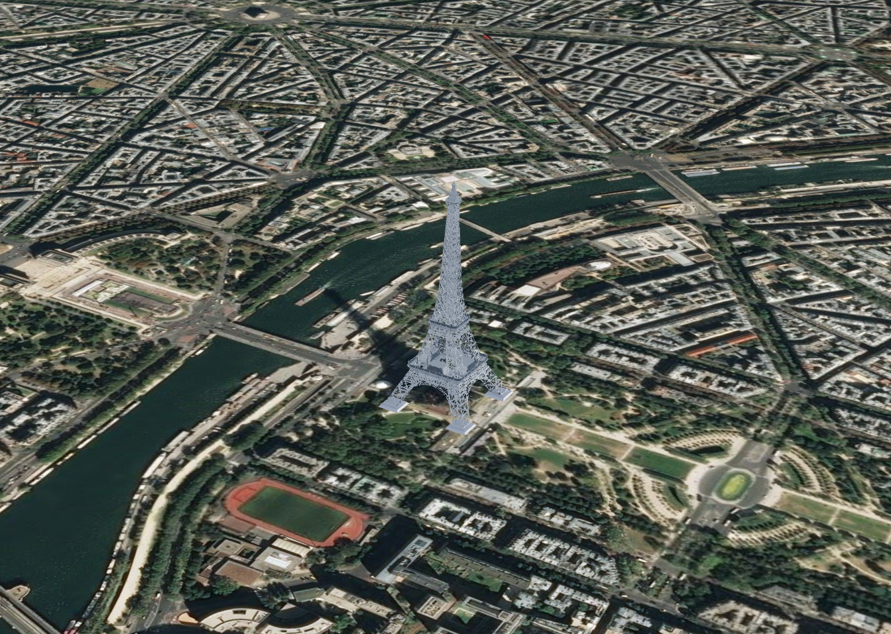

<!-- omit in toc -->
# EXT_geopose_basic_euler

**Version 0.0.0**, May 17, 2021

<!-- omit in toc -->
## Contributors

* Sam Suhag, Cesium
* Sean Lilley, Cesium
* Peter Gagliardi, Cesium

<!-- omit in toc -->
## Status

Draft

<!-- omit in toc -->
## Dependencies

Written against the [glTF 2.0 spec](../../../../../specification/2.0/README.md).

<!-- omit in toc -->
## Optional vs. Required

This extension is optional, meaning it should be placed in the `extensionsUsed` list, but not in the `extensionsRequired` list.

<!-- omit in toc -->
## Contents
- [Overview](#overview)
  - [GeoPose 1.0 Standard](#geopose-10-standard)
- [Coordinate Systems](#coordinate-systems)
- [Schema Updates](#schema-updates)
- [Property Reference](#property-reference)
- [Known Implementations](#known-implementations)
- [Appendix A: Transformation Matrix Computation](#appendix-a-transformation-matrix-computation)

## Overview

3D models of man-made and natural geographic features need to specify their position and orientation to be correctly placed on the Earth. This extension to glTF enables static placement of 3D models on the WGS84 ellipsoid.

*This section is non-normative.*

Shown below is a model of the Eiffel Tower, positioned and oriented in [CesiumJS](https://cesium.com/cesiumjs) using this extension:


<html>
  <center><i><a href="https://skfb.ly/AIU9">Source: Eiffel Tower by Johnson Martin on SketchFab.</a><a href="https://creativecommons.org/licenses/by/4.0/"> Licensed under CC 4.0</a></i></center>
</html>

Following is the extension JSON for the example above:

```json
{
  "extensions": {
    "EXT_geopose_basic_euler": {
      "longitude": 2.2945,
      "latitude": 48.8582,
      "height": 0.0,
      "ypr": {
        "yaw": 45.0,
        "pitch": 0.0,
        "roll": 0.0
      }
    }
  }
}
```

### GeoPose 1.0 Standard

GeoPose 1.0 is an OGC Implementation Standard for exchanging the location and orientation of real or virtual geometric objects (*Poses*) within reference frames anchored to the earth’s surface (*Geo*) or within other astronomical coordinate systems.

This extension implements [Standardization Target 2: Basic-Euler](https://github.com/opengeospatial/GeoPose/blob/main/standard/standard/standard/clause_7_normative_text.adoc#standardization-target-2-basic-euler) in the OGC GeoPose 1.0 Standard.

## Coordinate Systems

This extension uses WGS84 ([EPSG:4979](https://epsg.org/crs_4979/WGS-84.html)) as the coordinate reference system for specifying the position with longitude and latitude specified in degrees. Height above (or below) the ellipsoid must be specified in meters. The yaw-pitch-roll is provided as a rotation-only transform from a WGS84 referenced local tangent plane East-North-Up coordinate system.

```json
{
  "extensions": {
    "EXT_geopose_basic_euler": {
      "longitude": 46.7,
      "latitude": 25.067,
      "height": 691.0,
      "ypr": {
        "yaw": 0.0,
        "pitch": 0.0,
        "roll": 0.0
      }
    }
  }
}
```


## Schema Updates

Updates to the schema can be found in the [extension schema](schema/gltf.EXT_geopose_basic_euler.schema.json).

## Property Reference

- [EXT_geopose_basic_euler](#ext_geopose_basic_euler-property-reference)
  - [ypr](#ypr-property-reference)

<!-- omit in toc -->
### EXT_geopose_basic_euler Property Reference

glTF extension for specifying the position and orientation of models on the Earth.

**`glTF extension` Properties**

|   |Type|Description|Required|
|---|---|---|---|
|**longitude**|`number`|Longitude in the WGS84 datum. The angle must be specified in degrees. Must be in the range [-180, 180].| &#10003; Yes|
|**latitude**|`number`|Latitude in the WGS84 datum. The angle must be specified in degrees. Must be in the range [-90, 90].| &#10003; Yes|
|**height**|`number`|Heights are in meters above (or below) the WGS84 ellipsoid.|No|
|**ypr**|`object`|Rotation-only transformation from a WGS-84-referenced local tangent plane east-north-up coordinate system.| &#10003; Yes|
|**extensions**|`any`||No|
|**extras**|`any`||No|

Additional properties are allowed.

<!-- omit in toc -->
## glTF extension.longitude

Longitude in the WGS84 datum. The angle must be specified in degrees. Must be in the range [-180, 180].

* **Type**: `number`
* **Required**:  &#10003; Yes
* **Minimum**: ` >= -180`
* **Maximum**: ` <= 180`

<!-- omit in toc -->
## glTF extension.latitude

Latitude in the WGS84 datum. The angle must be specified in degrees. Must be in the range [-90, 90].

* **Type**: `number`
* **Required**:  &#10003; Yes
* **Minimum**: ` >= -90`
* **Maximum**: ` <= 90`

<!-- omit in toc -->
## glTF extension.height

Heights are in meters above (or below) the WGS84 ellipsoid.

* **Type**: `number`
* **Required**: No

<!-- omit in toc -->
## glTF extension.ypr

Rotation-only transformation from a WGS-84-referenced local tangent plane east-north-up coordinate system.

* **Type**: `object`
* **Required**:  &#10003; Yes

<!-- omit in toc -->
## glTF extension.extensions

* **Type**: `any`
* **Required**: No

<!-- omit in toc -->
## glTF extension.extras

* **Type**: `any`
* **Required**: No


<!-- omit in toc -->
### ypr Property Reference

Object describing the orientation of the glTF.

**`ypr` Properties**

|   |Type|Description|Required|
|---|---|---|---|
|**yaw**|`number`|Rotation about the LTP-ENU frame Z (up) axis. The angle must be specified in degrees.| &#10003; Yes|
|**pitch**|`number`|Pitch is rotation about the y axis of the yaw-rotated local frame. The angle must be specified in degrees.| &#10003; Yes|
|**roll**|`number`|Roll is rotation about the yaw and pitch rotated x axis of the local frame. The angle must be specified in degrees.|&#10003; Yes|
|**extensions**|`any`||No|
|**extras**|`any`||No|

<!-- omit in toc -->
## ypr.yaw

Rotation about the LTP-ENU frame Z (up) axis. The angle must be specified in degrees.

* **Type**: `number`
* **Required**: &#10003; Yes

<!-- omit in toc -->
## ypr.pitch

Pitch is rotation about the y axis of the yaw-rotated local frame. The angle must be specified in degrees.

* **Type**: `number`
* **Required**: &#10003; Yes

<!-- omit in toc -->
## ypr.roll

Roll is rotation about the yaw and pitch rotated x axis of the local frame. The angle must be specified in degrees.

* **Type**: `number`
* **Required**: &#10003; Yes

<!-- omit in toc -->
## ypr.extensions

* **Type**: `any`
* **Required**: No

<!-- omit in toc -->
## ypr.extras

* **Type**: `any`
* **Required**: No

## Known Implementations

- [Model.js in CesiumJS](https://github.com/CesiumGS/cesium/blob/43abc361591ef711409d43e6cf71e04daaa85865/Source/Scene/Model.js#L1882)

## Appendix A: Transformation Matrix Computation

The following JavaScript snippet shows how the position and orientation values can be used to compute a transformation matrix.

```javascript
var ypr = Cesium.HeadingPitchRoll.fromDegrees(heading, pitch, roll);
var origin = Cesium.Cartesian3.fromDegrees(longitude, latitude, height);
var modelMatrix = Cesium.Transforms.headingPitchRollToFixedFrame(origin, ypr);
```

See [`Transforms.headingPitchRollToFixedFrame`](https://github.com/CesiumGS/cesium/blob/dacc86c6a32f1ece62d66ac20b6ea5ff6f040ad0/Source/Core/Transforms.js#L385-L412) for more details.
