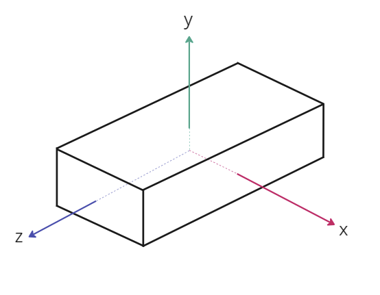
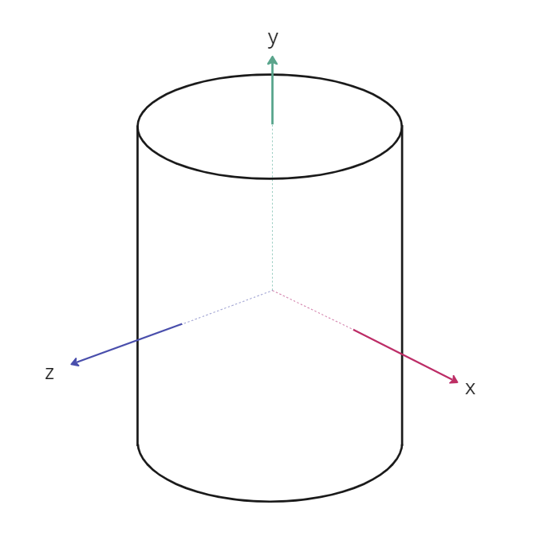
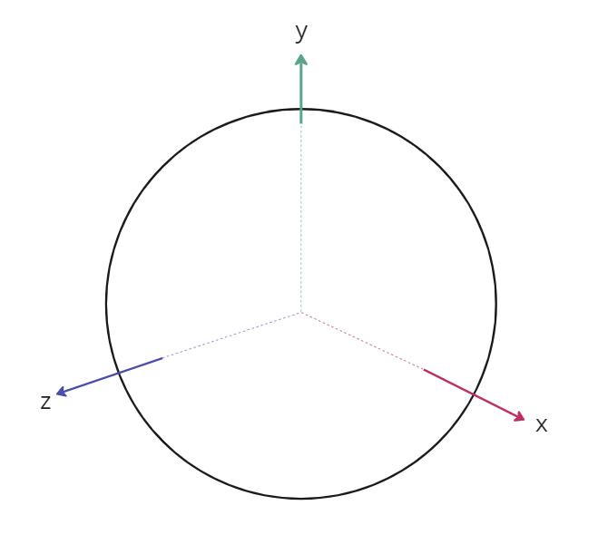

# EXT_implicit_geometry

## Contributors
- Sean Lilley, Cesium
- Janine Liu, Cesium

## Status
Draft

## Dependencies
Written against the glTF 2.0 specification.

## Overview

This extension allows glTF assets to define implicit geometry surfaces at the root level. This extension does not define any particular behavior for these shapes, but other extensions may build upon it for use in various functions.

## Supported Geometry

Currently, this extension supports the following implicit geometries:
- [`box`](#box)
- [`cylinder`](#cylinder)
- [`sphere`](#sphere)
- [`ellipsoid`](#ellipsoid)
- [`region`](#region)

The extension may also be extended itself to permit other geometry types. Only **one** shape may be defined at a time.

By default, the implicit 3D volume is assumed to fill the entire shape specified in the extension. However, shapes may allow an optional `slice` property to define the subsection of the shape in which the 3D volume is actually rendered. For instance, while the extension may define an implicit sphere, its `slice` can limit the volume to be only half of the full sphere.

### Box

The `box` property represents an axis-aligned box that is centered at the origin. The `size` property indicates its size in meters along the `x`, `y`, and `z` axes.

<table>
  <tr>
    <th>
    Example
    </th>
  </tr>
  <tr>
    <td><pre>
    "extensions": [
      {
        "EXT_implicit_geometry": {
          "geometries": [
            {
              "box": {
                "size": [1, 0.5, 2],
              }
            }
          ]
        }
      }
    ]
    </pre></td>
    <td>
    
    </td>
  </tr>
</table>

### Cylinder

The `cylinder` property represents a cylinder that is aligned with the `y`-axis and centered at the origin. The `radius` and `height` properties indicate the dimensions of the cylinder in meters. 

<table>
  <tr>
    <th>
    Example
    </th>
  </tr>
  <tr>
    <td><pre>
    "extensions": [
      {
        "EXT_implicit_geometry": {
          "geometries": [
            {
              "cylinder": {
                "radius": 2,
                "height": 3
              }
            }
          ]
        }
      }
    ]
    </pre></td>
    <td>
    
    </td>
  </tr>
</table>

### Sphere

The `sphere` property represents a sphere that is centered at the origin. The `radius` of the sphere is specified in meters.

<table>
  <tr>
    <th>
    Example
    </th>
  </tr>
  <tr>
    <td><pre>
    "extensions": [
      {
        "EXT_implicit_geometry": {
          "geometries": [
            {
              "sphere": {
                "radius": 2
              }
            }
          ]
        }
      }
    ]
    </pre></td>
    <td>
    
    </td>
  </tr>
</table>

### Ellipsoid

The `ellipsoid` property represents an ellipsoid that is centered at the origin. The `radii` property indicates the radii of the ellipsoid in meters along the `x`, `y`, and `z` axes.

**TODO** visual example

<table>
  <tr>
    <th>
    Example
    </th>
  </tr>
  <tr>
    <td><pre>
    "extensions": [
      {
        "EXT_implicit_geometry": {
          "geometries": [
            {
              "ellipsoid": {
                "radii": [2, 3, 4]
              }
            }
          ]
        }
      }
    ]
    </pre></td>
    <td>
    **TODO** visual example
    </td>
  </tr>
</table>
```

### Region

The `region` property represents a region extruded from the surface of a ellipsoid. The ellipsoid itself is not part of the geometry; it is merely used as reference from which the actual region is defined.

The reference ellipsoid is centered at the origin. The `semiMajorAxisRadius` indicates the radii of the ellipsoid in meters along the `x` and `z` axes. The `semiMinorAxisRadius` indicates the radius of the ellipsoid in meters along the `y` axis.

The `heightFromSurface` property indicates the height of the region from the ellipsoid's surface, in meters. In other words, the region begins atop ellipsoid's surface, and is then extruded outwards to the specified height.

<table>
  <tr>
    <th>
    Example
    </th>
  </tr>
  <tr>
    <td><pre>
    "extensions": [
      {
        "EXT_implicit_geometry": {
          "geometries": [
            {
              "region": {
                "semiMajorAxisRadius": 4,
                "semiMinorAxisRadius": 2,
                "heightFromSurface": 0.5 
              }
            }
          ]
        }
      }
    ]
    </pre></td>
    <td>
    **TODO** visual example
    </td>
  </tr>
</table>
```

## Optional vs. Required
This extension is required, meaning it should be placed in both the `extensionsUsed` list and `extensionsRequired` list.
