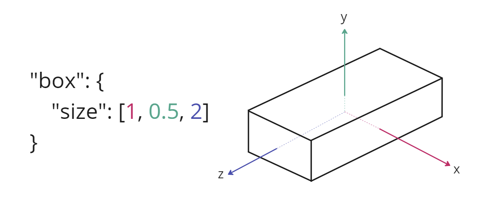

# EXT_implicit_geometry

## Contributors
- Sean Lilley, Cesium
- Janine Liu, Cesium

## Status
Draft

## Dependencies
Written against the glTF 2.0 specification.

## Overview

This extension allows mesh primitives to represent renderable implicit surfaces. Typically, a glTF mesh primitive requires `attributes` that supply mesh data, and uses `mode` to indicate the mesh topology. With `EXT_implicit_geometry`, the primitive may omit these properties and instead use the extension to infer the implicit 3D volume.

The following example illustrates how a primitive with this extension may represent an implicit box.

```
{
  "primitives": [
    {
      "extensions": {
        "EXT_implicit_geometry": {
          "box": {
            "size": [2, 2, 2]
          }
        }
      }
    }
  ]
}
```

Primitives with this extension may still be affected by node transforms to position, orient, and scale the shape as needed.

## Supported Geometry

Currently, this extension supports the following implicit geometries:
- [`box`](#box)
- [`cylinder`](#cylinder)
- [`sphere`](#sphere)
- [`ellipsoid`](#ellipsoid)
- [`region`](#region)

Only **one** shape may be defined at a time.

By default, the implicit 3D volume is assumed to fill the entire shape specified in the extension. However, each shape allows an optional `slice` property to define the subsection of the shape in which the 3D volume is actually rendered. For instance, while the extension may define an implicit sphere, its `slice` can limit the volume to be only half of the full sphere.

### Box

The `box` property represents an axis-aligned box that is centered at the origin. The `size` property indicates its size in meters along the `x`, `y`, and `z` axes.

<table>
  <tr>
    <th>
      Example
    </th>
    <th>
      Visual
    </th>
  </tr>
  <tr>
    <td><pre>
    "primitives": [
      {
        "extensions": {
          "EXT_implicit_geometry": {
            "box": {
              "size": [1, 0.5, 2],
            }
          }
        }
      }
    ]
    </pre></td>
    <td>
    
    </td>
  </tr>
</table>

### Cylinder

The `cylinder` property represents a cylinder that is aligned with the `y`-axis and centered at the origin. The `radius` and `height` properties indicate the dimensions of the cylinder in meters. 

<table>
  <tr>
    <th>
      Example
    </th>
    <th>
      Visual
    </th>
  </tr>
  <tr>
    <td><pre>
    "primitives": [
      {
        "extensions": {
          "EXT_implicit_geometry": {
            "cylinder": {
              "radius": 2,
              "height": 3
            }
          }
        }
      }
    ]
    </pre></td>
    <td>
    **TODO** visual example
    </td>
  </tr>
</table>

### Sphere

The `sphere` property represents a sphere that is centered at the origin. The `radius` of the sphere is specified in meters.

<table>
  <tr>
    <th>
      Example
    </th>
    <th>
      Visual
    </th>
  </tr>
  <tr>
    <td><pre>
    "primitives": [
      {
        "extensions": {
          "EXT_implicit_geometry": {
            "sphere": {
              "radius": 2,
            }
          }
        }
      }
    ]
    </pre></td>
    <td>
    **TODO** visual example
    </td>
  </tr>
</table>

### Ellipsoid

The `ellipsoid` property represents an ellipsoid that is centered at the origin. The `radii` property indicates the radii of the ellipsoid in meters along the `x`, `y`, and `z` axes.

**TODO** visual example

<table>
  <tr>
    <th>
      Example
    </th>
    <th>
      Visual
    </th>
  </tr>
  <tr>
    <td><pre>
      "primitives": [
        {
          "extensions": {
            "EXT_implicit_geometry": {
              "ellpisoid": {
                "radii": [2, 3, 4]
              }
            }
          }
        }
      ]
    </pre></td>
    <td>
    **TODO** visual example
    </td>
  </tr>
</table>
```

### Region

The `region` property represents a region above the surface of an ellipsoid. Though the ellipsoid itself is centered at the origin, the region may be distant from the origin due to its properties.

The `semiMajorAxis` property indicates the radii of the ellipsoid in meters along the `x`, `y`, and `z` axes.

## Optional vs. Required
This extension is required, meaning it should be placed in both the `extensionsUsed` list and `extensionsRequired` list.
