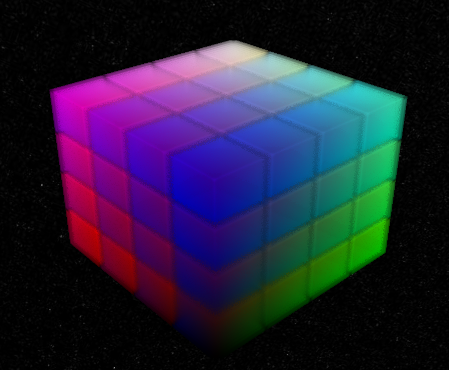
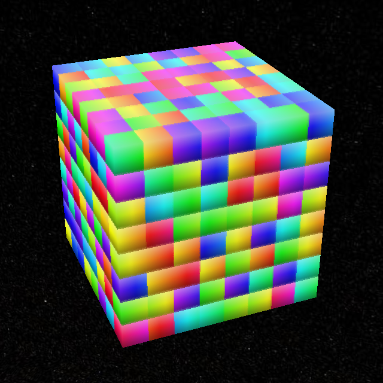
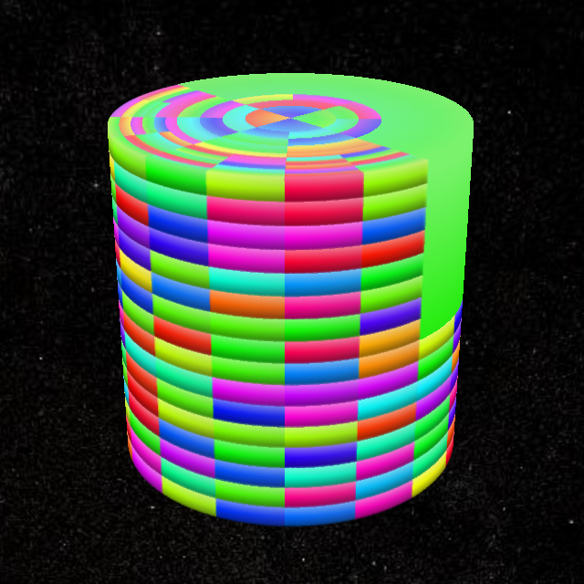
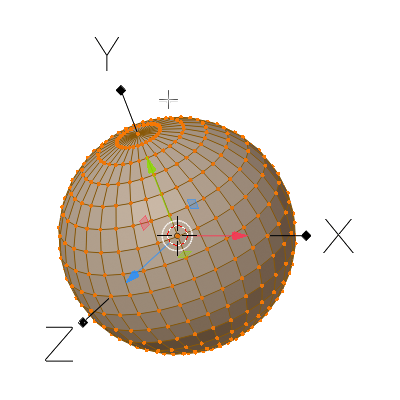

# EXT_primitive_voxels

<p align="center">
  
</p>

## Contributors
- Daniel Krupka, Cesium
- Ian Lilley, Cesium
- Sean Lilley, Cesium

## Status
Draft

## Dependencies
Written against the glTF 2.0 specification.

## Overview

This extension allows primitives to use their attribute data to represent volumetric (voxel) data.

```
{
  "meshes": [
    {
      "primitives": [
        {
          "attributes": {
            "_TEMPERATURE": 1
          },
          "mode": 2147483648,
          "extensions": {
            "EXT_primitive_voxels": {
              "dimensions": [8, 8, 8],
              "bounds": {
                "min": [0.25, 0.5, 0.5],
                "max": [0.375, 0.625, 0.625]
              },
              "padding": {
                "before": [1, 1, 1],
                "after": [1, 1, 1]
              }
            }
          }
        }
      ]
    }
  ]
}
```

The extension adds three new primitive modes, corresponding to voxel grid geometries:
- `0x80000000` (`2147483648`) - A Cartesian box. The grid is a Cartesian grid of equally-sized boxes.
- `0x80000001` (`2147483649`) - A cylinder. The grid is a stack of concentric rings, evenly divided around the circumference.
- `0x80000002` (`2147483650`) - An ellipsoid. The grid is a set of concentric ellipsoids, divided evenly in latitude and longitude.

The lowest byte is reserved for future voxel modes: `0x80000000`-`0x800000FF`.

|Box|Cylinder|Ellipsoid|
| ------------- | ------------- | ------------- |
||||

These grids all define "unit" objects centered at the origin, contained in the bounding box between `(-1, -1, -1)` and `(1, 1, 1)`. Node transforms should be used to position, orient, and scale the voxel grid as needed. The `POSITION` attribute is _not_ required or used by this extension - all positioning is through node transforms.

The `dimensions` property of the extension specifies the voxel grid dimensions:
- x / y / z for boxes
- radius / height / angle for cylinders
- longitude / latitude / height for ellipsoids

Dimensions must be nonzero. Elements are laid out in memory first-axis-contiguous, e.g. for boxes, `x` data is contiguous (up to stride).

The `bounds` property describes which section of the primitive is mapped to the voxel grid. `bounds.min` and `bounds.max` specify a "rectangular" region of the voxel grid in the appropriate coordinate systems:
- Boxes: a rectangular region of the box, between `(-1, -1, -1)` and `(1, 1, 1)`. **This is essentially a no-op - prefer using node transforms for boxes**.
- Cylinders: a slice of the cylinder, between `(0, -1, -pi)` and `(1, 1, pi)`
- Ellipsoids: a surface patch with height, between `(-pi, -pi/2, 0)` and `(pi, pi/2, 1)`

The `padding` property specifies how many rows of attribute data in each dimension come from neighboring grids. This is useful in situations where the primitive represents a single tile in a larger grid, and data from neighboring tiles is needed for non-local effects e.g. trilinear interpolation, blurring, antialiasing. `padding.before` and `padding.after` specify the number of rows before and after the grid in each dimension, e.g. a `padding.before` of 1 and a `padding.after` of 2 in the `y` dimension mean that each series of values in a given `y`-slice is preceded by one value and followed by two.

The padding data must be supplied with the rest of the voxel data - this means if `dimensions` is `[d1, d2, d3]`, `padding.before` is `[b1, b2, b3]`, and `padding.after` is `[a1, a2, a3]`, the attribute must supply `(d1 + a1 + b1)*(d2 + a2 + b2)*(d3 + a3 + b3)` elements.

## Optional vs. Required
This extension is required, meaning it should be placed in both the `extensionsUsed` list and `extensionsRequired` list.
