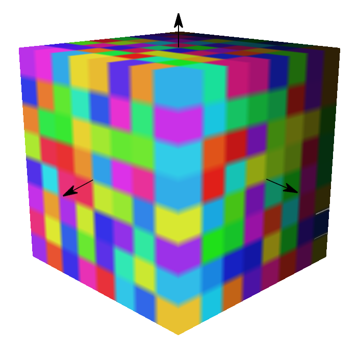

# EXT_primitive_voxels

<p align="center">
  
</p>

## Contributors
- Daniel Krupka, Cesium
- Ian Lilley, Cesium
- Sean Lilley, Cesium
- Janine Liu, Cesium
- Jeshurun Hembd, Cesium

## Status
Draft

## Dependencies
Written against the glTF 2.0 specification.

## Overview

This extension allows mesh primitives to represent volumetric (voxel) data via custom attributes. Primitives that use this extension must set their `mode` to the constant `0x80000000` (`2147483648`), which is used to indicate voxels.

Typically, glTF mesh primitives use the `POSITION` attribute to store positional mesh data. However, `POSITION` is neither required nor used by this extension. Instead, `EXT_primitive_voxels` relies on the [`EXT_implicit_geometry` extension](../EXT_implicit_geometry/) to describe the shape of the voxel grid.  

```
"primitives": [
  {
    "mode": 2147483648,
    "extensions": {
      "EXT_implicit_geometry": {
        "box": {
          "size": [2, 2, 2]
        }
      },
      "EXT_primitive_voxels": {
          "dimensions": [8, 8, 8],
          "padding": {
            "before": [1, 1, 1],
            "after": [1, 1, 1]
          },
          "attributes": {
            "_TEMPERATURE": 0
          },
      }
    }
  }
]
```

Although voxels are commonly associated with cubic geometry on a box-based grid, this extension allows voxels to be based on other types of grid geometry from `EXT_implicit_geometry`. This includes cylinders and regions, visualized below.

|Box|Cylinder|Region|
| ------------- | ------------- | ------------- |
||||

Within this geometry, voxels exist inside a bounding volume that conforms to the geometry of the grid. The `dimensions` property refers to the number of subdivisions _within_ this bounding volume. Each value of `dimensions` must be a positive integer.

The relationship between `dimensions` and the grid geometry is explained in detail below.

### Box Grid

A **box** grid is a Cartesian grid defined by `x`, `y`, and `z` axes with equally-sized boxes. A voxel primitive that is based on a box grid may be defined like so:

```
{
"extensions": {
  "EXT_implicit_geometry": {
    "box": {
      "size": [2, 2, 2]
      }
    },
    "EXT_primitive_voxels": {
      "dimensions": [8, 8, 8],
      "attributes": {
        "_TEMPERATURE": 0
      },
    }
  }
}
```

The `dimensions` correspond to the subdivisions of the box along the `x`, `y`, and `z` axes respectively.


<p align="center"><i>A box grid spanning from -1 to 1 in all three axes, subdivided into two cells along each axis. The origin is in the center of the box.</i></p>

These properties may be used to define the scale of the box grid, independent of the `scale` applied by a node. Additionally, the `dimensions` may be non-uniform.


<p align="center"><i>A box grid that is non-uniformly scaled due to its min and max properties. It is also non-uniformly subdivided.</i></p>

### Cylindrical Grid

A **cylinder** grid is subdivided along the radius, height, and angle ranges of the cylinder, visualized below.


The cylinder is aligned with the `y`-axis in the primitive's local space. As such, the `height` is subdivided along that local `y`-axis. Subdivisions along the `radius` are concentric, centered around the `y`-axis and extending outwards. The `angle` is subdivided around the circumference of the cylinder.

A voxel primitive that is based on a cylinder grid may define the `cylinder` property like so:

```
{
"extensions": {
  "EXT_implicit_geometry": {
    "cylinder": {
      "radius": 2,
      "height": 3
      }
    },
    "EXT_primitive_voxels": {
      "dimensions": [8, 8, 8],
      "attributes": {
        "_TEMPERATURE": 0
      },
    }
  }
}
```

[TODO](image)

### Ellipsoidal Grid

For **ellipsoid** geometry, the `bounds` refer to the section of the ellipsoid that the voxel data occupies. `(-pi, -pi/2, 0)` and `(pi, pi/2, 1)`

 Elements are laid out in memory on a first-axis-contiguous basis. For instance, with box-shaped voxels, the `x` data is contiguous (up to stride).


contains minimum and maximum values along the axes and/or parameters that control the grid's shape. These ranges are interpreted relative to the geometry of the grid, as indicated by the primitive's `mode`.

### Padding

```
 "padding": {
    "before": [1, 1, 1],
    "after": [1, 1, 1]
  }
```

The `padding` property specifies how many rows of attribute data in each dimension come from neighboring grids. This is useful in situations where the primitive represents a single tile in a larger grid, and data from neighboring tiles is needed for non-local effects e.g. trilinear interpolation, blurring, antialiasing. `padding.before` and `padding.after` specify the number of rows before and after the grid in each dimension, e.g. a `padding.before` of 1 and a `padding.after` of 2 in the `y` dimension mean that each series of values in a given `y`-slice is preceded by one value and followed by two.

The padding data must be supplied with the rest of the voxel data - this means if `dimensions` is `[d1, d2, d3]`, `padding.before` is `[b1, b2, b3]`, and `padding.after` is `[a1, a2, a3]`, the attribute must supply `(d1 + a1 + b1)*(d2 + a2 + b2)*(d3 + a3 + b3)` elements.

### Full Example

```
{
  "meshes": [
    {
      "primitives": [
        {
          "attributes": {
            "_TEMPERATURE": 0
          },
          "mode": 2147483648,
          "extensions": {
            "EXT_primitive_voxels": {
              "dimensions": [8, 8, 8],
              "bounds": {
                "min": [0.25, 0.5, 0.5],
                "max": [0.375, 0.625, 0.625]
              },
              "padding": {
                "before": [1, 1, 1],
                "after": [1, 1, 1]
              }
            }
          }
        }
      ]
    }
  ]
}
```
### Metadata

This extension may be paired with the `EXT_structural_metadata` extension.

{
  "extensions": {
    "EXT_structural_metadata": {
    
    }
  },
  "meshes": [
    {
      "primitives": [
        {
          "attributes": {
            "_TEMPERATURE": 0
          },
          "mode": 2147483648,
          "extensions": {
            "EXT_primitive_voxels": {
              "dimensions": [8, 8, 8],
              "bounds": {
                "min": [0.25, 0.5, 0.5],
                "max": [0.375, 0.625, 0.625]
              },
              "padding": {
                "before": [1, 1, 1],
                "after": [1, 1, 1]
              }
            }
          }
        }
      ]
    }
  ]
}

## Optional vs. Required
This extension is required, meaning it should be placed in both the `extensionsUsed` list and `extensionsRequired` list.
